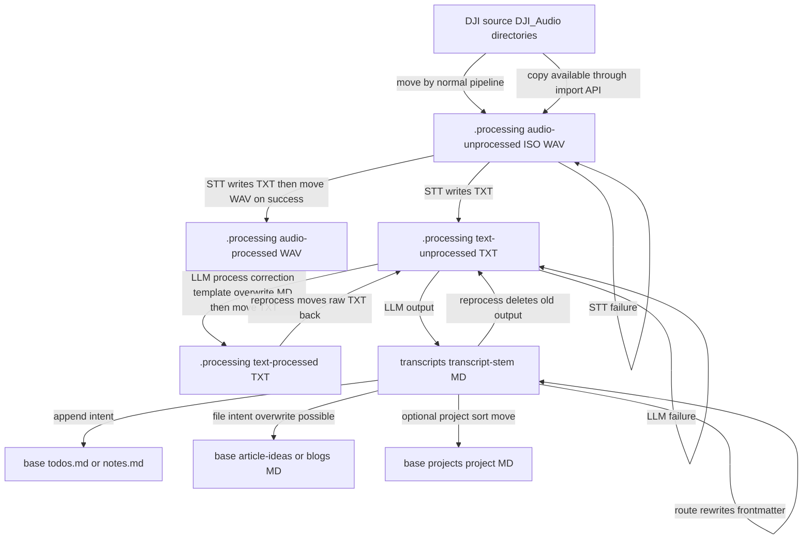

# Runtime Files, Metadata, and Mutation Boundaries

The runtime workspace is a filesystem-backed pipeline rather than a database. `Pipeline.run()` owns the normal lifecycle: it imports audio, transcribes it, enhances and templates raw text, routes detected intents, then optionally classifies the finished full transcripts. The `transcriber process` command loads configuration, applies its command-line overrides, invokes that sequence, and reports stage counters. [System overview](/openwiki/architecture/system-overview.md) describes the broader component layout; [Configuration and output](/openwiki/concepts/configuration-and-output.md) and [Intent routing and classification](/openwiki/concepts/intent-routing-and-classification.md) provide complementary user-facing views.

## Workspace model

`paths.base` is the workspace root, defaulting to `~/Resources/Transcripts`. Its derived paths expand `~` and intentionally separate hidden, intermediate state from user-facing results:

| Path relative to `paths.base` | Role | Normal producer and terminal transition |
| --- | --- | --- |
| `.processing/audio-unprocessed/` | Imported or manually staged uppercase `.WAV` inputs awaiting STT | Import creates it; successful STT **moves** the audio to `audio-processed`. |
| `.processing/audio-processed/` | Audio whose STT result was reported successful | Terminal audio state in the normal run. |
| `.processing/text-unprocessed/` | Raw `*.txt` emitted by the STT provider awaiting LLM processing | Successful LLM, correction, and template work **moves** it to `text-processed`. |
| `.processing/text-processed/` | Retained raw text associated with completed LLM processing | Normally terminal, but `reprocess` can move one file back to `text-unprocessed`. |
| `transcripts/` | Flat staging area for complete `transcript-<raw-stem>.md` files | Routing rewrites files in place; optional project sorting moves them away. |
| `projects/<project>/` | Final project-organized files in the normal sorter mode | `sort_transcript(..., move=True)` moves the transcript here. |
| intent targets beneath the base | Durable captures such as `todos.md`, `notes.md`, `article-ideas/`, and `blogs/` | Dispatch either appends an entry or writes an individual Markdown file. |

The default locations are resolved by looking first for `transcriber.toml` in the current directory, then `~/.config/transcriber/config.toml`, otherwise by constructing defaults. An explicit `--config` path is used when it exists; a nonexistent specified path also falls back to defaults. The `process` flags mutate the in-memory configuration only: `--template` replaces the template name, `--dictionary` appends one dictionary path, `--sort` enables classification, and `--no-llm-fallback` disables fallback routing. `--skip-import` skips only the import stage, allowing manually placed audio in `audio-unprocessed` to continue through the later stages.



This diagram shows the normal audio and text transitions, plus the dispatch and optional project-sorting branches. “Copy available through import API” and copy-mode sorting are library capabilities; the normal `Pipeline` calls both import and sorting in move mode.

## Normal lifecycle and success boundary

### 1. Import: device file to timestamped staging audio

The importer scans immediate `DJI_Audio_*` directories beneath `paths.dji_source` in sorted directory order and considers only immediate `*.WAV` files. A filename must match `DJI_<number>_YYYYMMDD_HHMMSS.WAV`; matching files are renamed to `YYYY-MM-DD-HH-MM-SS.WAV`. It creates the destination even when the source mount does not exist, and returns zero counts for a missing source. Invalid names and already-existing timestamp destinations are skipped rather than replaced. File-system `OSError` during a transfer is recorded as a failure and processing continues.

Although `import_dji_audio` exposes `move=False` for a metadata-preserving `shutil.copy2`, the normal pipeline explicitly passes `move=True`. Therefore a successfully imported recording leaves the DJI source and becomes the renamed file in `audio-unprocessed`; source preservation requires using the API in copy mode or manually staging files.

### 2. Transcription: audio advances only after a usable text file

The pipeline creates the raw-text and processed-audio directories, verifies the selected STT provider is available, and enumerates direct `*.WAV` files in `audio-unprocessed`. The built-in `ParakeetProvider` runs `parakeet-mlx` with `--output-format txt` and `--output-dir`; success requires that `<audio stem>.txt` actually exists after the command returns, not merely that the command returned successfully. For every successful provider result, the pipeline moves the `.WAV` to `audio-processed`. A failed result increments the failure count and leaves the audio file staged for a later retry; if the provider is unavailable or there are no audio files, the stage returns zero work rather than raising a pipeline failure.

The configuration model permits `parakeet` or `whisper`, but the current STT factory implements only `parakeet`; choosing an unimplemented provider reaches an `Unknown STT provider` error. Treat the configuration literal as validation surface, not proof of an installed implementation.

### 3. LLM processing: raw text is retained until all postprocessing succeeds

For each direct `*.txt` file in `text-unprocessed`, the pipeline asks the LLM provider to create `transcripts/transcript-<text stem>.md`. The built-in Ollama implementation reads the raw text, invokes `ollama run <model>` with a 15-minute timeout, strips ANSI sequences and an initial recognized `Thinking...` trace, then writes the resulting Markdown. On a successful provider result, the pipeline applies merged term dictionaries and overwrites that same output file, renders the selected Jinja template and overwrites it again, then moves the raw `.txt` to `text-processed`. Thus the successful-file boundary is **after** correction and templating, rather than immediately after the LLM writes Markdown.

If LLM processing reports failure, the raw text stays in `text-unprocessed` and the failure is counted. An unavailable LLM similarly produces zero work. The factory currently implements only `ollama` even though the configuration literal also admits `claude`; an unimplemented selection raises `Unknown LLM provider`. The pipeline does not provide rollback for a failure after a provider has already written its output: writes and subsequent moves are separate filesystem operations.

Template selection is `output.template` (default `default.md`). The renderer searches caller-supplied directories first, then `~/.config/transcriber/templates/`, then packaged templates; the normal pipeline does not supply caller directories. Templates receive `content` plus `metadata.source_file` and date-derived `metadata.tags` such as `#transcript #2026 #2026-04`. Template output is not itself the routing metadata contract: a template can introduce its own Markdown or YAML structure, and the later routing stage prepends generated frontmatter to the whole rendered text.

## Routing, dispatch, and metadata mutation

Routing runs after LLM processing and scans every direct `*.md` currently in `transcripts/`, not only files produced in the current invocation. It reads the full existing file, derives a source name by removing `transcript-` from its stem and appending `.WAV`, and uses `datetime.now()` for metadata. Regex routing runs first; fallback LLM classification is attempted only when regex finds no intent and fallback is enabled and available. If enabled classification rules exist, routing also assigns a project and rule-derived tags before dispatch. Intent tags are merged and de-duplicated in first-seen order.

For every scanned main transcript, routing calls `write_text()` with a generated frontmatter block followed by the text it read. This is an **overwrite**, not a frontmatter-aware merge: an already-routed transcript is read as content and receives another generated block on the next routing pass. The `date` consequently represents routing time, not parsed DJI-recording time. Reruns may also re-dispatch the same extracted intents, so append targets can acquire duplicate entries and individual intent-file names can collide.

### Generated frontmatter contract

`generate_frontmatter()` emits a block terminated by `---` and a trailing newline. Its required fields and conditions are:

```yaml
---
date: 2026-03-30T14:32:00
source: DJI_0042.WAV
tags: ["#article_idea", "#summit_lab", "#ai"]
intent: article_idea       # only when a non-empty value is supplied
project: summit-lab        # only when a non-empty value is supplied
assigned: John             # only when a non-empty value is supplied
---
```

`date` is `datetime.isoformat()`, `source` is the supplied audio filename, and tags are double-quoted and deduplicated while preserving their first occurrence. Main transcript metadata receives `intent` from the primary route and the optional project; it does not receive `assigned`. Individual intent files can receive all optional fields, including the extracted assignee. In particular, do not infer safe YAML escaping or preservation of pre-existing frontmatter: this generator interpolates scalar `source`, `intent`, `project`, and `assigned` values directly and routing replaces the full main file.

### Dispatch boundaries

An intent definition specifies `output` and `target`; built-ins map todos and notes to append targets, while article ideas and blogs map to directories for individual files. Dispatch first finds the matching definition for each extracted intent. An LLM fallback can name an intent with no configured definition; its type tag remains in main-transcript metadata, but it is not written to an intent target.

| Mode | Filesystem effect | Content contract and cautions |
| --- | --- | --- |
| `append` | Creates the target parent directories and opens the target with mode `"a"`; it never replaces existing bytes. | Appends a checkbox line and a backticked `YYYY-MM-DD HH:MM | source | tags` line. An assignee adds `Assigned: ...`; an embedded intent adds `*Extracted from: <transcript>*`. No de-duplication or idempotency check is performed. |
| `file` | Creates the target directory, then `write_text()` creates or **overwrites** `<YYYY-MM-DD>-<slug>.md`. | The slug comes from the first 60 characters of intent content after lowercasing, punctuation removal, whitespace/underscore collapse, and trailing-hyphen removal. File content is generated frontmatter, a blank line, and the complete main transcript text—not just extracted intent content. Same-day identical slugs select the same path. |

## Optional project sorting

Classification is a separate final phase, enabled through `[classify].enabled` or `transcriber process --sort`. The latter does not provide a rules path: a usable `classify.rules_file` must still be configured. If rules are absent or their file is missing, the phase prints a message and leaves transcripts in `transcripts/`.

Rules are ordered YAML project entries with keywords. Matching is case-insensitive substring search; the first rule with any match wins. Its classification tags include `#<project>` with hyphens changed to underscores plus one normalized tag for every matching keyword in that winning rule. No match becomes `misc` with no tags. Classification during routing enriches main-transcript metadata, while the final sorter reads the on-disk transcript and moves it to `projects/<project>/<original filename>`. `sort_transcript` also supports `move=False`, which uses `copy2` and preserves the original, but both the pipeline stage and the standalone `transcriber classify` command use the default move mode. The sorter creates destination directories but has no destination-conflict guard or local error handling, so operators should avoid duplicate filenames in a project directory.

Because routing precedes sorting, dispatch sees the transcript while it is still in `transcripts/`; after a successful move, later normal runs no longer route or sort that file from the flat directory. Intent targets are not relocated by project sorting.

## Maintenance commands and destructive operations

These commands do not run the complete normal lifecycle, and their mutation semantics matter when operating on user data:

- `transcriber reformat <file> --template <name>` reads exactly the given file and overwrites it with the selected template rendering. It does not parse or preserve existing frontmatter, and repeated reformatting templates the prior rendered document as `content`.
- `transcriber reprocess <file>` resolves a relative filename under `transcripts/`, derives `<stem-without-transcript-prefix>.txt`, and looks in `text-processed` before `text-unprocessed`. If the raw text is in `text-processed`, it moves it back to `text-unprocessed`; then, if the requested transcript exists, it **unlinks the old Markdown before checking LLM availability**. It reruns LLM processing, dictionary correction, and templating, and finally moves the raw text to `text-processed`. It does not invoke routing or project sorting, so its replacement lacks the normal routing-generated frontmatter unless another process later routes it. Missing raw text is reported as an error without deleting the transcript.
- `transcriber classify <file> --rules <path>` reads and moves the specified existing file to the configured workspace’s `projects/<project>/` directory. It is an immediate sorting operation, not a copy or metadata update.

Use `text-processed` as the recovery source for reprocessing and treat `transcripts/` as a mutable staging area. If retention, auditability, or retry safety are required, preserve source-device audio with import copy mode, back up outputs before `reprocess`/`reformat`, and avoid repeated routing of unsorted files without an external idempotency policy.

## Operational checks and focused tests

Before processing, confirm the intended workspace with `transcriber config`, ensure `parakeet-mlx` and `ollama` are available for the configured built-in providers, and verify a rules file before enabling `--sort`. The end-to-end test exercises a mocked device import through `transcriber process`, the `--skip-import` path, unavailable STT handling, and directory creation. Focused tests also pin the important mutation semantics: import skips an existing timestamp target; successful sorting removes the source while copy mode preserves it; append preserves earlier entries; individual intent files carry frontmatter; and generated frontmatter deduplicates tags. These tests establish intended contracts, but they do not make the multi-step filesystem transitions transactional.

## Related pages

- [System overview](/openwiki/architecture/system-overview.md)
- [Configuration and output](/openwiki/concepts/configuration-and-output.md)
- [Intent routing and classification](/openwiki/concepts/intent-routing-and-classification.md)
- [Process recordings workflow](/openwiki/workflows/process-recordings.md)
- [Transcript maintenance workflow](/openwiki/workflows/transcript-maintenance.md)
