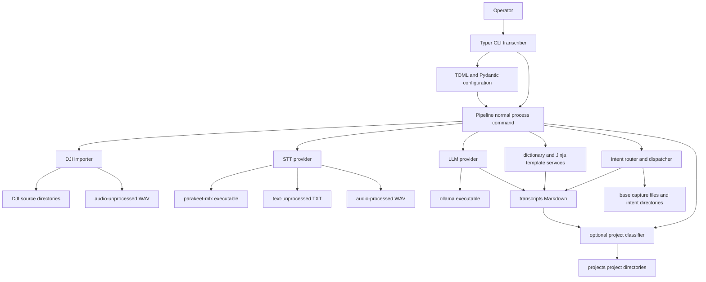

# System Architecture and Ownership Boundaries

Transcriber is a local, filesystem-backed processing application for DJI recordings. Its installed `transcriber` command is deliberately thin: it loads configuration, applies command-specific overrides, and either delegates the normal workflow to `Pipeline` or calls a focused maintenance service. `Pipeline` owns ordering and per-run counters; focused modules own the mechanics of importing, transcription, model processing, correction, formatting, routing, dispatch, classification, and metadata generation. There is no database, queue, server, or durable job object—directories and files are both the work queue and the system’s durable state.

The detailed file transitions and mutation cautions are documented in [Runtime Files, Metadata, and Mutation Boundaries](/openwiki/architecture/runtime-file-lifecycle.md). For behavior at the intent seam, see [Intent routing and classification](/openwiki/concepts/intent-routing-and-classification.md); operational prerequisites belong in [External tools and models](/openwiki/integrations/external-tools-and-models.md).

## Component map and control flow

This diagram shows the normal `transcriber process` composition: the CLI and pipeline coordinate local services, providers adapt external executables, and the workspace holds every intermediate and final artifact.

### Normal run contract

`transcriber process` creates `Pipeline(config, console=console)` and calls `run()`. The pipeline always loads correction dictionaries, then executes stages in this order:

1. import DJI audio unless `--skip-import` is set;
2. transcribe staged audio;
3. process staged raw text through the LLM, then correct and template the result;
4. route every current transcript and dispatch extracted intents; and
5. optionally project-sort transcripts when classification is enabled.

The returned `PipelineResult` reports stage counters rather than per-file objects; its `total_successful` is the number processed by the LLM/content stage. The pipeline is batch-oriented: transcription and LLM failures are counted per input and leave that input in its unprocessed directory for retry. An unavailable provider causes that stage to report no work rather than aborting the run, so later stages can still operate on existing workspace contents. Conversely, misconfigured provider names reach the provider factories and raise `ValueError`; the configuration literals currently advertise `whisper` and `claude`, but only Parakeet and Ollama are implemented in the factories.

The routing and sorting stages scan the current `transcripts/` directory, not a list returned by the preceding stage. This is intentional filesystem composition, but it means a run may route older transcripts even when no fresh transcription or LLM processing occurred. Routing runs before sorting so dispatch has access to the flat transcript staging area.

## Boundary guide: where a change belongs

| Change concern | Owned boundary | Do not put it in |
| --- | --- | --- |
| Command shape, validation, console messaging, config/flag precedence, and focused operator actions | `cli.py` | `Pipeline` or provider implementations |
| Stage ordering, directory selection, provider selection, success counters, and transitions between workflow stages | `Pipeline` in `pipeline.py` | a provider or template |
| Device directory scanning, DJI filename normalization, move/copy policy, and import accounting | `audio.py` | the CLI or STT provider |
| Turning one audio file into one raw text file and determining executable availability | `STTProvider` implementations in `stt.py` | `Pipeline` |
| Turning raw text into model-produced Markdown, executable invocation, timeout, and model-output cleanup | `LLMProvider` implementations in `llm.py` | the router or template service |
| Terminology replacements and template lookup/rendering | `dictionary.py` and `templates.py` | an LLM provider |
| Trigger matching, extraction, fallback interpretation, tags, and intent result data | `router.py` and `intents.py` | `dispatch.py` |
| Markdown frontmatter and append-versus-file persistence of extracted intents | `frontmatter.py` and `dispatch.py` | trigger parsing |
| Rule-based project selection and relocation | `classify.py` | intent routing or template rendering |
| Workspace roots, provider/model selection, template/dictionary/routing/classification settings | `config.py` plus the user TOML | hard-coded service paths |

This separation is important for safe extension. A new model or STT backend should implement the respective abstract provider contract and be registered by its factory; it should return a result rather than move downstream artifacts itself. A new voice capture category is primarily an intent YAML and dispatch-policy change, while a new project taxonomy is a classification-rules change. New normal-workflow ordering belongs in `Pipeline.run()`, where it can maintain the retry and counter semantics.

## Entrypoints and CLI responsibilities

Packaging exposes `transcriber.cli:app` as the `transcriber` console script. The Typer app supplies `--version` and these command families:

- `process` is the full-workflow entrypoint. Its `--template`, `--dictionary`, `--sort`, and `--no-llm-fallback` options override only the in-memory configuration for that invocation; `--skip-import` alters only the first pipeline stage.
- `classify` is a direct, single-file move into the configured `projects/` root. It validates that the transcript and rules file exist before calling the classifier.
- `reprocess` is a targeted LLM/correction/template recovery path, not a `Pipeline` run. It derives the associated raw text from the transcript name, moves a processed raw text back to the unprocessed area if necessary, replaces the requested Markdown, and does not route or project-sort the replacement.
- `reformat` overwrites a specified existing file with a newly rendered template. It does not parse or preserve frontmatter.
- `config` and `templates` are inspection commands. `models` reports packaged Ollama Modelfiles and, when `ollama` is on `PATH`, checks `ollama list`; `models-create <name>` runs `ollama create` with the selected packaged Modelfile.

`load_config()` owns configuration discovery: it prefers `transcriber.toml` in the current directory, then `~/.config/transcriber/config.toml`, and otherwise uses model defaults. The core configuration partitions values into paths, STT, LLM, output, dictionaries, classification, and router settings. Derived workspace paths are computed from `paths.base`; therefore a consumer should configure the base root rather than duplicating intermediate directories in each component.

### Maintenance-command caution

The direct commands deliberately bypass orchestration and hence its normal guarantees. In particular, `reprocess` deletes the existing transcript after finding its raw text but before checking LLM availability, and it leaves the regenerated file without the normal routing frontmatter unless it is routed later. Treat `reprocess`, `reformat`, and standalone `classify` as explicit file mutation tools, not idempotent views of a transcript.

## Provider abstractions and external process boundary

`STTProvider` defines `is_available()` and `transcribe(audio_file, output_dir) -> TranscribeResult`. The built-in `ParakeetProvider` uses `shutil.which("parakeet-mlx")` for availability and invokes `parakeet-mlx <audio> --output-format txt --output-dir <directory>`. A successful executable exit is insufficient: the provider also requires `<audio stem>.txt` to exist. This makes the provider responsible for translating an external process result into the internal success contract, while the pipeline alone moves a successful input WAV from `audio-unprocessed` to `audio-processed`.

`LLMProvider` similarly defines availability and `process(input_file, output_file) -> ProcessResult`. `OllamaProvider` checks for `ollama`, then feeds raw text to `ollama run <model>`. It creates the destination parent, applies a 900-second timeout, strips ANSI sequences and a recognized leading `Thinking...` trace, and writes cleaned stdout to the requested Markdown path. Timeout, non-zero process exit, and a missing executable become unsuccessful `ProcessResult` values rather than provider exceptions. The same provider exposes `classify(prompt)`, used by routing with a shorter 60-second subprocess timeout.

Keep model-specific prompt construction, subprocess command lines, output sanitization, and timeouts inside a provider. The router depends only on a duck-typed fallback object with `is_available()` and `classify()`, so an alternative LLM fallback must preserve the expected JSON response shape rather than teach routing about a vendor API. Factory registration is required as well: today `get_stt_provider()` maps only `"parakeet"`, and `get_llm_provider()` maps only `"ollama"`.

## Content processing and output composition

The model output is not the final transcript contract. After a successful LLM result, the pipeline applies a merged correction dictionary and then renders the selected Jinja2 template with `content`, `metadata.source_file`, and date-derived `metadata.tags`; each step rewrites the same transcript Markdown path. Built-in dictionaries are always loaded, and configured dictionary files contribute additional corrections in list order. Template discovery is ordered: caller-supplied directories, then `~/.config/transcriber/templates/`, then packaged templates. The normal pipeline supplies no caller directory, so a user template with the same filename shadows its packaged counterpart.

Intent processing is a separate post-formatting concern:

- `Pipeline` loads a configured intents YAML file when it exists and otherwise uses packaged definitions. Those definitions select trigger phrases plus an `append` or `file` output target.
- `route_text_with_fallback()` first applies deterministic, case-insensitive regex matching. It identifies start-of-text intents and sentence-level embedded intents, including `{person}` capture triggers; each extraction carries a type, content, position, optional person, and tags.
- The fallback LLM is called only when regex finds no intent and an available fallback was supplied. Its JSON may add tags and intents; malformed JSON, subprocess failures, or absent fallback return the regex result rather than fail routing.
- The pipeline optionally enriches routing with the first matching classification rule, merges classification and intent tags in first-seen order, prepends generated frontmatter to the full transcript, and dispatches each extraction using the matching intent definition.

The separate final classifier performs ordered, case-insensitive substring matching: the first project rule with a matching keyword wins, and no match is `misc`. `sort_transcript()` defaults to moving the transcript under `projects/<project>/`; its copy mode is a library option, not what the normal pipeline uses.

### Filesystem output ownership and non-idempotency

The filesystem replaces a persistence layer, and modules make deliberately different mutation choices:

- Import moves valid, non-duplicate DJI `.WAV` files into `.processing/audio-unprocessed/` under ISO-style names. A successful STT result advances the WAV to `audio-processed/`; failed audio remains staged.
- STT creates raw `.txt` under `text-unprocessed/`. Only a successful LLM result followed by corrections and template rendering moves the raw text to `text-processed/`; an LLM failure leaves it retryable.
- LLM output is initially `transcripts/transcript-<raw-stem>.md`. Routing reads and overwrites every transcript it sees to prepend generated metadata. It does not recognize or merge existing frontmatter, so repeated routing can add another frontmatter block.
- `append` dispatch creates parent directories and appends checklist entries to its target. `file` dispatch writes a dated, slug-derived Markdown filename in its target directory and may overwrite a same-day collision. Neither mode deduplicates reruns.
- Optional project sorting moves main transcripts out of `transcripts/`; intent captures remain where dispatch wrote them.

Those behaviors define the operational boundary: components may create their owned destination directories, but a provider must not advance an input file, and a downstream stage must not assume transactions or rollback across earlier writes and moves. Use the lifecycle page before changing names, locations, or retry behavior.

## Tests that protect the architecture

The highest-value tests are layered rather than a single real-tool integration suite. `tests/test_e2e.py` runs the CLI through import, mocked `parakeet-mlx`, mocked `ollama`, `--skip-import`, unavailable STT, and workspace-directory creation. `tests/test_pipeline.py` pins stage delegation, the `skip_import` control path, and the result-counter contract.

At the seams, provider tests verify factory selection and Ollama ANSI/thinking-trace cleanup; router tests cover start and embedded extraction, person capture, regex-over-fallback precedence, and degraded fallback behavior. Dispatch and classifier tests protect append preservation, generated intent-file structure, first-match rule selection, and move versus copy behavior. When changing a boundary, extend the focused seam test first, then add an E2E scenario only if the CLI-to-filesystem composition changes.

## Related pages

- [Runtime Files, Metadata, and Mutation Boundaries](/openwiki/architecture/runtime-file-lifecycle.md)
- [Intent routing and classification](/openwiki/concepts/intent-routing-and-classification.md)
- [External tools and models](/openwiki/integrations/external-tools-and-models.md)
- [Process recordings workflow](/openwiki/workflows/process-recordings.md)
