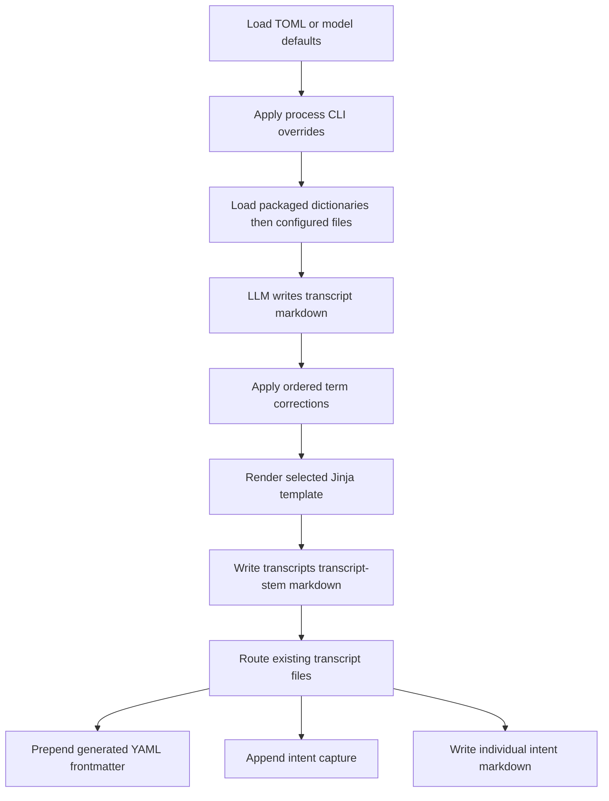

# Configuration, Dictionaries, Templates, and Markdown Output

Transcriber has two distinct output layers. The LLM produces an initial Markdown body; the processing phase corrects terminology and wraps that body in a selected Jinja2 template. The later routing phase prepends the system’s YAML frontmatter and may dispatch extracted content to other Markdown files. This separation matters: templates control the rendered body, while `frontmatter.py` owns the metadata emitted during routing and intent-file dispatch.

This page documents that contract and the configuration decisions that feed it. For on-disk transitions and rerun hazards, see [Runtime Files, Metadata, and Mutation Boundaries](/openwiki/architecture/runtime-file-lifecycle.md). For the intent decisions that supply route tags and dispatch targets, see [Intent routing and classification](/openwiki/concepts/intent-routing-and-classification.md).

## Configuration resolution and precedence

`load_config()` constructs a `TranscriberConfig` Pydantic model. With no explicit path, it chooses the **first existing** location in this order:

1. `./transcriber.toml` in the process working directory;
2. `~/.config/transcriber/config.toml`;
3. model defaults, if neither exists.

Passing `--config` to a supported command supplies the explicit path instead of discovery, but a path that does not exist also returns model defaults rather than failing. TOML is parsed only for an existing selected file and passed to Pydantic validation. Consequently, bad TOML, incompatible values, or unsupported values for constrained fields fail while loading; a missing file does not.

`config/default.toml` is a copyable example, not a third discovery candidate. It illustrates the intended sections and defaults, including the normal workspace, `parakeet`, `ollama`, `transcriber:latest`, `default.md`, and optional classification settings. The in-code `DictionaryConfig` default is an empty list, however, whereas the example config opts into `dictionaries/tech-terms.yaml`. A run with no user configuration therefore applies packaged dictionaries only; it does **not** automatically load the repository’s example `tech-terms.yaml`.

### What configuration controls

| Section | Key operational effect |
| --- | --- |
| `[paths]` | Sets `base` and `dji_source`. Derived workspace locations place mutable intermediates under `<base>/.processing/` and completed main transcripts under `<base>/transcripts/`. `base` is expanded when derived paths are built. |
| `[stt]` | Selects `parakeet` or `whisper` at validation time and may provide a provider-specific model. |
| `[llm]` | Selects `ollama` or `claude` at validation time and sets the model name. |
| `[output]` | Selects the Jinja template filename, default `default.md`. |
| `[dictionaries]` | Lists additional YAML correction files to append to the packaged correction set. |
| `[classify]` | Enables the final project-sorting phase and identifies its rules file. |
| `[router]` | Optionally points at an intents file and controls whether LLM fallback routing is enabled, defaulting to `true`. |

Pydantic supplies defaults for omitted model fields, so a small TOML file can specify only the sections that differ. Provider literals are validation constraints rather than a guarantee that a factory implements or that the executable is available; inspect the provider and runtime documentation before switching one.

### Command-line overrides

The `process` command loads configuration first and then mutates that in-memory object. Its effective precedence is **CLI flag > selected TOML file > Pydantic default**:

| `transcriber process` option | Effect after loading configuration |
| --- | --- |
| `--config` / `-c` | Chooses the explicit configuration path instead of normal discovery. |
| `--template` / `-t` | Replaces `output.template` for this invocation. |
| `--dictionary` / `-d` | Appends one path to `dictionaries.paths`; it does not replace configured paths. |
| `--sort` | Sets `classify.enabled` to `True`; a usable rules file is still required. |
| `--no-llm-fallback` | Sets `router.llm_fallback` to `False`. |
| `--skip-import` | Changes pipeline execution rather than configuration: later stages run but device import is omitted. |

`reprocess` supports the same `--config`, `--template`, and additive `--dictionary` behavior for a single raw transcript. `classify` accepts `--config` and may replace its configured rules file with `--rules`. `reformat` takes a template directly but neither loads TOML nor preserves a separate configuration context. Use `transcriber config` to print the resolved model and `transcriber templates` to enumerate the available template names.

> **Path-resolution caution:** configured dictionary and classification-rule paths are converted directly with `Path(...)`; they are not resolved relative to the TOML file. In particular, the example `dictionaries/tech-terms.yaml` is relative to the command’s working directory. The code expands `~` for the configured intent file and the base workspace-derived paths, but not for dictionary paths or the classification rules path.

## Correction dictionaries

A dictionary is a YAML document with a `corrections` list. Each entry must provide `wrong` and `right` strings:

```yaml
corrections:
  - wrong: "Long Chain"
    right: "LangChain"
  - wrong: "para keet"
    right: "Parakeet"
```

The packaged `redhat-ecosystem.yaml` supplies a baseline vocabulary for Red Hat, automation, AI/ML, and infrastructure terms such as `OpenShift`, `LangChain`, and `kubectl`. `Pipeline._load_dictionary()` always loads every packaged `.yaml` or `.yml` dictionary, then loads the configured list if present. It concatenates the packaged correction entries before user entries; `reprocess` uses the same combination.

This is ordered composition, **not key-based override semantics**. `Dictionary.apply()` walks entries in order and runs a case-insensitive escaped literal substitution for each one. Thus all matches are replaced with the canonical `right` spelling, later rules see the output from earlier rules, and user rules run after packaged rules. There is no per-`wrong` map, word-boundary check, collision detection, or validation of a correction schema beyond later dictionary access. Design user corrections with that sequential behavior in mind rather than expecting a same-key user entry to supersede a packaged one.

The loaders have deliberately different absence behavior:

- `load_dictionary(path)` opens exactly one requested file and raises `FileNotFoundError` if it is missing.
- `load_dictionaries(paths)` silently skips each non-existent configured path, but reads and merges every path that exists.
- `find_dictionaries()` scans only immediate `*.yaml` and `*.yml` files in each existing search directory, sorting each extension group; packaged loading uses it over the package dictionary directory.

Once the LLM provider has successfully written its Markdown, the pipeline reads that output, applies the combined dictionary, and overwrites the same output before templating. Failed or malformed existing YAML is not converted into a recoverable “missing dictionary” condition by this code; treat dictionary changes as executable input to the pipeline and test them before batch processing.

## Templates and rendering

Template selection is a template name resolved through loader search paths, not a template-directory setting in TOML. `render_transcript()` builds a fresh Jinja2 environment and asks it for the configured name. Its search directories, in descending precedence, are:

1. caller-provided `extra_template_dirs` that exist;
2. `~/.config/transcriber/templates/`, if it exists;
3. the package’s `src/transcriber/builtin_templates/`, always present as a fallback.

The normal `Pipeline` and `reprocess` call the renderer without extra directories. Therefore a file in the user template directory with the same name shadows the packaged version. `list_templates()` follows the same precedence while de-duplicating names and returns a sorted list of immediate `.md`, `.txt`, and `.j2` files; it does not report which directory supplied a name.

The renderer explicitly supplies these application context values:

```jinja2
{{ content }}
{{ metadata }}
```

`content` is the already LLM-processed and dictionary-corrected string. `metadata` is a dictionary. During normal processing and `reprocess`, it contains `source_file` and `tags`; the latter is a single Markdown tag string created from the raw filename stem. Other built-in templates expose optional fields such as `title`, `date`, `event`, and `location`, but the normal processing caller does not populate those fields. A custom caller can use them only by calling `render_transcript()` with corresponding metadata.

The Jinja environment preserves a trailing newline, trims and left-strips block whitespace, and disables automatic escaping. Template authors must therefore handle Markdown, YAML, or HTML escaping appropriate to their own output and should expect missing templates or template syntax/render errors to propagate. In the pipeline, rendering is after an LLM output has been written but before the raw `.txt` is moved to processed storage, so a rendering exception can leave that output file and raw text in an intermediate state rather than producing a counted provider failure.

### Built-in body layouts and date tags

The default template emits an optional first line of tags, `# Transcript`, optional source and date display lines, a horizontal rule, and `content`. `summary.md` and `trip-report.md` are heading-oriented alternatives. `blog.md` emits a tag line and its own YAML frontmatter using optional `title`, `date`, and `tags` metadata.

For a raw filename stem with at least two hyphen-delimited components, the pipeline produces:

```text
#transcript #<year> #<year>-<month>
```

For example, `2026-04-18-09-22-49.txt` provides `#transcript #2026 #2026-04`; a stem without two components produces only `#transcript`. These are inline Obsidian-style tags in the template body, not the routing-generated YAML tags described below.



This flow shows the ordering of the configuration-driven rendering path and the later routing metadata and dispatch path.

## Markdown and frontmatter contract

Routing reads every direct `*.md` file in `transcripts/`, determines intent and classification tags, de-duplicates the resulting tags in first-seen order, generates metadata, then overwrites the main file as `frontmatter + blank line + previously read text`. The generated block is valid YAML-shaped Obsidian frontmatter with a final newline:

```yaml
---
date: 2026-03-30T14:32:00
source: DJI_0042.WAV
tags: ["#article_idea", "#summit_lab", "#ai"]
intent: article_idea
project: summit-lab
assigned: John
---
```

`date`, `source`, and `tags` are always written. The timestamp is `datetime.isoformat()` at routing/dispatch time; the source is derived by removing `transcript-` from the main filename and adding `.WAV`. `intent`, `project`, and `assigned` are written only for truthy supplied values. Tags are double-quoted and the generator removes exact duplicates while preserving input order.

The metadata consumers differ:

- A **main transcript** receives route-derived `tags`, its primary intent if any, and a classification project if any. It does not receive an `assigned` value from an extracted person intent.
- A **file-dispatched intent** receives its own tags and type plus optional project and assignee, followed by the full main transcript text.
- An **append-dispatched intent** has no YAML block. It becomes a Markdown checkbox and a backticked `YYYY-MM-DD HH:MM | source | tags` detail line, with optional `Assigned:` and an `*Extracted from:*` reference for embedded intents.

### Preserve the ownership boundary

Do not make a template responsible for system frontmatter. In the normal run, templates render *before* routing, and routing blindly prepends a newly generated block to the entire rendered text. A template such as `blog.md` may therefore contribute a second YAML-looking block farther down the file rather than merging with the later system block. Similarly, routing does not parse or replace existing frontmatter: rerouting an unsorted main transcript adds another generated block before the prior file contents and may re-dispatch the same intents.

This is also why the body’s date tags and YAML `tags` should not be conflated. The template gets static filename-derived inline tags, whereas the YAML list is populated from routing, intent extraction, and optional classification. The latter list can be empty even while the rendered body starts with `#transcript` date tags.

`reprocess` replaces the transcript body via LLM, dictionary, and template work but does not invoke routing; its result has the template’s date-tag/body layout but no newly generated routing frontmatter. `reformat` is more direct: it reads an existing file as `content` and overwrites it with a selected template rendering, without parsing or preserving old frontmatter. Back up or copy files before applying either operation to material you need to retain.

## Safe customization and focused verification

A practical setup is to copy `config/default.toml` to `~/.config/transcriber/config.toml`, adjust `paths`, add stable terminology to a YAML dictionary, and install a same-named or new template under `~/.config/transcriber/templates/`. Run the following checks before a batch run:

```bash
transcriber config
transcriber templates
transcriber process --config ~/.config/transcriber/config.toml --template default.md
```

Use `--dictionary` for one-off additions rather than replacing the configured list. If testing templates against a valuable transcript, copy it first: both pipeline rendering and `reformat` overwrite files. Prefer one YAML frontmatter owner—the routing generator—unless a downstream workflow explicitly accepts an embedded second block.

The focused tests lock down the contracts that are easiest to regress: configuration-derived processing paths and router defaults; case-insensitive correction and missing-file behavior; packaged vocabulary; template lookup precedence, metadata passing, and date-tag layout; YAML field inclusion and tag deduplication; and append versus file dispatch formatting. The end-to-end workflow additionally exercises loading a partial TOML configuration through `transcriber process` with mocked providers.

## Related pages

- [Runtime Files, Metadata, and Mutation Boundaries](/openwiki/architecture/runtime-file-lifecycle.md)
- [Intent routing and classification](/openwiki/concepts/intent-routing-and-classification.md)
- [Process recordings workflow](/openwiki/workflows/process-recordings.md)
- [Transcript maintenance workflow](/openwiki/workflows/transcript-maintenance.md)
