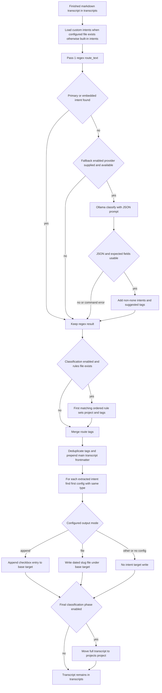

# Intent Extraction, Dispatch, and Project Classification

Transcriber turns a finished transcript into several independent decisions:

1. **Intent routing** detects explicit capture instructions such as `Todo` or `Article idea`, optionally extracting an assignee and additional embedded captures.
2. **Fallback classification** asks the configured LLM for a constrained JSON-shaped answer only when deterministic routing found nothing.
3. **Project classification** chooses one project from ordered keyword rules and contributes tags.
4. **Dispatch** writes every extracted intent to its configured append target or individual-file directory, while the complete transcript receives generated metadata and may later be moved into a project directory.

`Pipeline.run()` performs routing after LLM processing and before its optional final project-sorting step. The `transcriber process` entrypoint invokes that lifecycle; `transcriber classify <file>` exposes only the move-based project sorter for an existing file. This page focuses on the decision and dispatch contracts. See [Runtime Files, Metadata, and Mutation Boundaries](/openwiki/architecture/runtime-file-lifecycle.md) for the full filesystem lifecycle and [Configuration, Dictionaries, Templates, and Markdown Output](/openwiki/concepts/configuration-and-output.md) for configuration and frontmatter ownership.

## End-to-end decision flow



This flow shows the source-defined ordering: regex is authoritative when it finds any intent, fallback errors leave routing non-fatal, dispatch occurs before the normal pipeline's move-based project sorting, and only the full transcript is sorted.

## Intent definitions and configuration boundary

An `IntentConfig` is loaded from YAML with these required fields: `type`, `triggers`, `output`, and `target`; `extract` defaults to `{}`. `load_intents()` raises `FileNotFoundError` for a directly requested missing file. In the normal pipeline, however, `_load_intents()` uses the configured `router.intents_file` only if its expanded path exists; otherwise it silently falls back to the package's `src/transcriber/builtin_intents.yaml`.

The router configuration has two controls:

| Setting | Default | Effect |
| --- | --- | --- |
| `router.intents_file` | `null` | Optional YAML replacement for the package intent definitions. `~` is expanded by the pipeline before the existence check. |
| `router.llm_fallback` | `true` | Allows the pipeline to supply an available LLM provider for the second pass. `transcriber process --no-llm-fallback` sets it to `false` for that run. |

The built-in YAML defines two `todo` entries, followed by `article_idea`, `note`, and `blog`:

| Type / trigger family | Built-in triggers | Output / target |
| --- | --- | --- |
| `todo` | `todo`, `to do`, `reminder` | `append` to `todos.md` |
| `todo` with person placeholder | `speak to {person} about`, `talk to {person} about`, `ask {person} about`, `tell {person} about` | `append` to `todos.md` |
| `article_idea` | `article idea`, `blog idea`, `writing idea` | `file` in `article-ideas/` |
| `note` | `note`, `quick note` | `append` to `notes.md` |
| `blog` | `blog post`, `blog draft` | `file` in `blogs/` |

The schema is a lightweight dataclass conversion, not a validation layer for trigger quality, allowed intent types, output modes, or safe paths. The dispatcher recognizes only exact `append` and `file` values. A custom type returned by fallback or a custom `output` value that is not one of those values can still appear in main-transcript metadata, but it has no corresponding target write.

> **Duplicate type caution:** dispatch finds the **first** configured entry whose `type` equals an extracted intent's type. The two built-in `todo` entries happen to use the same mode and target. Custom duplicate types with different output settings are therefore ambiguous: the first entry controls dispatch.

## Pass 1: deterministic regex extraction

`route_text(text, intents)` returns a `RoutingResult` containing the unmodified `full_text`, optional `primary_intent`, extracted records, a project slot, and tags. Each `ExtractedIntent` records `type`, trigger-stripped `content`, the lowercased configured `trigger`, optional `person`, `position` (`start` or `embedded`), and intent-local tags.

### Primary intent, specificity, and trigger matching

The router strips outer whitespace and partitions intent definitions into person-placeholder and simple groups. It always tries person-placeholder triggers before simple triggers, then iterates definitions and their triggers in YAML order until the first start match. That result becomes `primary_intent` and is also the first extracted intent with `position="start"`.

Both pattern families are compiled with `re.IGNORECASE | re.DOTALL`. A primary match must begin the stripped transcript (the regex patterns also encode sentence/newline boundary alternatives, but `pattern.match()` is applied at the beginning). The configured trigger is regex-escaped, so it is interpreted as literal text, and simple triggers allow one optional comma, colon, or hyphen before their content. The rest of the transcript becomes the primary item's content; primary extraction does not stop at the first sentence.

Do not treat these patterns as general natural-language matching. In particular, the simple pattern does not impose a trailing word boundary after the literal trigger. A short custom trigger can therefore match the beginning of a longer token. Conversely, the initial-position requirement prevents ordinary prose such as `I want to do something` from becoming a primary `to do` capture.

### `{person}` triggers

A trigger containing the literal placeholder `{person}` has a special pattern. The text before and after the placeholder is literal, while the placeholder captures a non-greedy sequence of word characters and whitespace up to the trigger's following literal phrase. With the built-in phrases, `Speak to Mary Jane about the project` yields person `Mary Jane` and content `the project`.

Person extraction is case-insensitive and does not enforce capitalization despite the helper's descriptive comment. It emits two tags: `#<intent type>` and a lowercased person name with spaces changed to underscores. The `extract` YAML mapping is carried into `IntentConfig`, but routing identifies this behavior from `{person}` in the trigger rather than consulting the mapping's value; the extracted `person` is later consumed by dispatch/frontmatter.

### Embedded captures and sentence boundaries

After determining the primary item, the router searches for embedded captures:

- With a primary intent, it splits the transcript at `.`, `!`, or `?` followed by whitespace and scans only sentences after the first. Consequently, a second trigger in the primary sentence is not separately extracted.
- Without a primary intent, it scans every sentence produced by that same split.
- It can append at most one extracted intent per sentence. For each sentence, person-placeholder definitions take precedence over simple definitions, and the first matching definition/trigger wins.
- The extracted embedded content is limited to the next `.`, `!`, or `?` that is followed by whitespace or end-of-text. In the usual split-sentence path, this is the sentence's remaining text without its terminator.

Person-placeholder embedded patterns can locate the configured phrase anywhere in a sentence. Simple embedded triggers are narrower: they can start a sentence or follow punctuation plus whitespace, or the lead-in words `and`, `also`, or `oh` plus whitespace. This supports captures such as `Todo, check CI` and conversational continuations such as `Oh and todo, buy a microphone`, while avoiding an unrestricted scan for every simple trigger in normal prose.

Each simple intent gets only `#<type>`; person intents additionally get the normalized person tag. The primary intent and embedded captures are independent: a transcript that starts with an article idea can still produce later embedded todos.

## Pass 2: LLM fallback and fail-open contract

`route_text_with_fallback()` always runs regex first. It returns immediately—and does **not** call the LLM—when either `primary_intent` or any embedded intent was found. It also returns the regex result when no provider is supplied or `provider.is_available()` is false. Thus fallback is an absence-of-any-regex-match mechanism, not an enrichment pass for deterministic matches.

For an eligible fallback, the router appends the complete transcript to this requested JSON shape:

```json
{
  "intents": [{"type": "todo|article_idea|note|blog|none", "content": "extracted text", "position": "start|embedded"}],
  "suggested_tags": ["#tag1", "#tag2"]
}
```

The built-in `OllamaProvider.classify()` runs `ollama run <model>` with that prompt and a 60-second subprocess timeout. It strips ANSI escape sequences and a recognized leading `Thinking...` trace before returning stdout for JSON parsing.

On a valid parsed object, the router extends result-level tags with `suggested_tags`. It skips items whose `type` is `none`; for all other items it creates an intent marked `trigger="llm-fallback"`, uses empty content when `content` is absent, defaults missing `position` to `embedded`, and sets `primary_intent` only when the item position is exactly `start`. Fallback-created intents initially have the type tag only.

This is a requested contract rather than strict response validation: the parser does not enforce the advertised type enum, tag format, or position enum. Missing data needed by the implementation can cause a handled failure, and a fallback type with no matching configured intent is not dispatched.

### Failure behavior

The fallback deliberately fails open for JSON decoding errors, missing required keys, absent attributes, subprocess failures (including timeout), and a missing executable. Those exceptions are swallowed, and the function returns its current routing result rather than failing the pipeline. When regex found nothing—as required for fallback eligibility—that normally means no extracted intent; tags added before a later handled parsing failure are not rolled back. Availability checks avoid a fallback subprocess when Ollama is not installed.

This fail-open behavior applies to the routing decision, not all configuration and filesystem work. For example, malformed intent YAML, an exception outside the caught fallback set, or a later dispatch write can still fail its caller.

## Classification: ordered keyword semantics

Project classification is independent from intent detection. `load_rules()` reads YAML `projects` entries into ordered `ClassifyRule` objects, each with a project `name` and optional `keywords`. The supplied `config/classify-rules.yaml` orders `langchain`, `openshift`, then `ansible` and provides project-specific keyword lists.

`classify_text()` lowercases the transcript and performs case-insensitive **substring** searches in rule order, then keyword order. The first keyword in the first matching rule determines the returned project and `matched_keyword`; it does not count matches, choose the most specific phrase, or select the earliest occurrence in the text. If a transcript matches keywords for multiple projects, the earlier YAML project wins.

For that winning project, tags are constructed as follows:

1. Add `#<project>` after replacing hyphens with underscores.
2. Walk **all** keywords of the winning rule in their configured order and add a tag for every keyword that appears in the text, lowercasing it and replacing spaces and hyphens with underscores.
3. Do not repeat an identical tag.

No matching keyword returns `("misc", None, [])`. Only the winning rule contributes keyword tags, even if the text also mentions a later project's keywords.

During `_route_and_dispatch()`, usable enabled classification runs before metadata generation: it assigns `result.project` (including `misc`) and appends classification tags. During the optional final pipeline phase, classification is run again by `sort_transcript()` over each direct Markdown file still in `transcripts/`. The sorter creates `projects/<project>/` and normally moves the full file there; its public `move=False` mode instead uses `copy2`. The standalone `transcriber classify` command also uses the default move mode and exits with an error if the chosen/configured rules file or input transcript is absent.

## Tag aggregation and main-transcript metadata

Tag scope matters:

- **Result tags** are for the main transcript. In fallback cases, suggested tags arrive first; enabled classification tags are appended next; then each extracted intent's local tags are appended in extraction order.
- The pipeline deduplicates result tags by exact string while preserving first occurrence, then generates main transcript frontmatter with those tags, `primary_intent`, and the classified project.
- **Intent-local tags** are what append and file dispatch receive. Classification tags are not copied into each dispatched item's tag list, although a file-mode item does receive the project as a separate frontmatter field.

For every direct `*.md` in `transcripts/`, routing reads the full existing contents, derives the source name from its filename, and overwrites the file with newly generated frontmatter plus the previously read text. It does not parse or replace an existing block. Re-running routing on a transcript that has not yet been sorted can therefore nest frontmatter, repeat dispatch, and refresh metadata timestamps.

## Output dispatch modes

After main-transcript metadata is written, the pipeline dispatches each extracted intent using the first same-type configuration entry. Targets are resolved below `paths.base`.

| Mode | Write behavior | Content contract |
| --- | --- | --- |
| `append` | Creates parent directories and opens the target in append mode. Existing content remains. | Adds `- [ ] <content>` and a backticked timestamp/source/tags line. An extracted person adds `Assigned: <person>`. An embedded intent adds `*Extracted from: <main transcript>*`; a start-position item does not. |
| `file` | Creates the target directory and overwrites a date-and-slug path if it already exists. | The name is `<YYYY-MM-DD>-<slug>.md`, where the slug comes from the first 60 content characters after lowercase/punctuation/whitespace normalization. The file has generated frontmatter for that intent and the complete pre-routing transcript text as its body, not merely extracted content. |

Append mode has no idempotency check, so a reroute can create duplicate checklist entries. File mode is similarly not collision-safe: same-day captures resolving to the same slug target the same path. These operations are deliberately distinct from project sorting; intent targets stay under the base directory while only the full transcript is moved to `projects/`.

## Operating and extending safely

1. **Start with explicit, sufficiently distinctive triggers.** Trigger ordering and person-before-simple precedence are behavior, not metadata. Test short or overlapping custom triggers against transcripts because matching is literal/case-insensitive but not a full token parser.
2. **Use one output contract per type.** If duplicate type entries are necessary for trigger organization, keep their `output` and `target` identical, or split them into distinct types so first-match dispatch cannot surprise you.
3. **Treat LLM output as advisory and fallible.** Enable fallback only with an available provider, keep expected types aligned with configured types, and rely on explicit triggers for deterministic capture. Use `transcriber process --no-llm-fallback` when regex-only behavior is required.
4. **Order rules intentionally.** Put higher-priority projects earlier and remember that substring matching can make a broad keyword win before a later, more exact rule. Validate rule edits with direct classification examples.
5. **Protect reruns and collisions.** Routing mutates complete transcripts and dispatch has no deduplication; final sorting normally removes them from the routing directory. Back up or sort successful transcripts, and choose content conventions that avoid same-day file slug collisions.

Focused tests cover the important regression boundaries: start, punctuation, case-insensitive, multi-word, person, embedded, and start-plus-embedded routing; skipped, unavailable, `none`, and timeout fallback behavior; append versus file formatting; first-match and `misc` classification; move versus copy sorting; and intent YAML loading. Run the focused groups during changes:

```bash
uv run pytest tests/test_router.py tests/test_dispatch.py tests/test_classify.py tests/test_intents.py
```

## Related pages

- [Runtime Files, Metadata, and Mutation Boundaries](/openwiki/architecture/runtime-file-lifecycle.md)
- [Configuration, Dictionaries, Templates, and Markdown Output](/openwiki/concepts/configuration-and-output.md)
- [External tools and models](/openwiki/integrations/external-tools-and-models.md)
- [Process recordings workflow](/openwiki/workflows/process-recordings.md)
