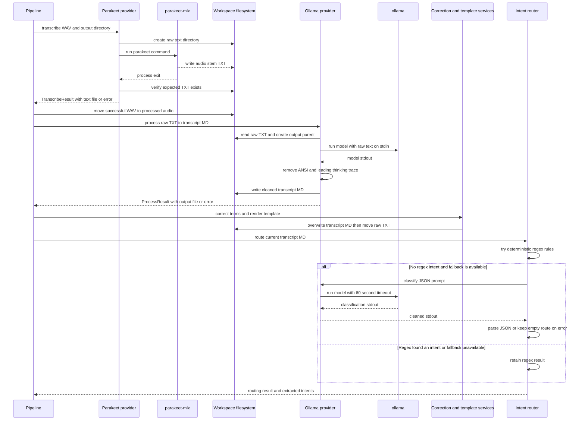

# DJI, Speech-to-Text, and Ollama Integrations

Transcriber is a local, filesystem-backed application: the DJI storage volume, `parakeet-mlx`, and `ollama` are command-line integration boundaries rather than network services or Python SDK dependencies. The normal `transcriber process` command loads configuration, optionally imports device audio, and delegates stage ordering to `Pipeline`. Providers translate an executable invocation into a result object; the pipeline owns downstream moves, corrections, templates, routing, and counters.

This page defines the contracts at those boundaries. For all workspace transitions, see [Runtime Files, Metadata, and Mutation Boundaries](/openwiki/architecture/runtime-file-lifecycle.md). For the router’s extraction and dispatch semantics, see [Intent routing and classification](/openwiki/concepts/intent-routing-and-classification.md).

## Integration map and returned artifacts



This sequence shows the source-defined subprocess calls and file artifacts. A successful process exit alone does not make STT successful: the expected `.txt` must exist. In contrast, the LLM provider writes its cleaned stdout to the requested Markdown path before returning success; subsequent correction and template writes are pipeline work.

## Configuration versus implementation

Configuration defaults to the DJI source `/Volumes/DJI_MIC2`, the `parakeet` STT provider, the `ollama` LLM provider, and model `transcriber:latest`. `paths.base` defaults to `~/Resources/Transcripts`; it derives the intermediate audio/text folders and final `transcripts/` location. Configuration discovery uses `./transcriber.toml` first, then `~/.config/transcriber/config.toml`, otherwise model defaults. `transcriber config` prints the effective provider and model selections.

There is an important distinction between **declared values** and **implemented providers**:

| Area | Values admitted by configuration | Factory implementation today | Operational implication |
| --- | --- | --- | --- |
| STT | `parakeet`, `whisper` | `parakeet` only | Selecting `whisper` passes configuration validation but `get_stt_provider()` raises `ValueError`. |
| LLM | `ollama`, `claude` | `ollama` only | Selecting `claude` likewise reaches an unknown-provider error. |

A usable configuration therefore needs both an implemented name and its executable on `PATH`. Both built-in providers use `shutil.which()` for their availability check; pipeline stages print an unavailable-provider message and return zero work when that check is false. This is different from choosing a declared but unregistered provider, which is a factory error rather than an unavailable result.

## DJI-mounted storage import

### Accepted source layout and naming contract

The importer treats `paths.dji_source` as a mounted or otherwise local directory. It creates the destination directory before checking the source, searches only immediate `DJI_Audio_*` child directories in sorted order, and considers only immediate uppercase `*.WAV` files. A candidate filename must match this shape:

```text
DJI_<number>_YYYYMMDD_HHMMSS.WAV
```

The timestamp fields are retained and written as `YYYY-MM-DD-HH-MM-SS.WAV`; for example, `DJI_01_20250702_175446.WAV` becomes `2025-07-02-17-54-46.WAV`. The importer returns `ImportResult` counts for discovered files, processed transfers, skips, and transfer failures.

A missing source path is not an error result: it produces the already-created destination and zero counts. Invalid DJI-looking names and a destination that already exists are skipped. A filesystem `OSError` during a move or copy increments `failed` and allows later files to be considered. Duplicate protection is by normalized destination filename, so recordings that map to the same timestamp are not overwritten.

### Ownership and safety

`import_dji_audio()` defaults to `move=True`; the normal pipeline explicitly uses that mode. Thus a successful import removes the source WAV from the DJI location and stages the renamed file in `.processing/audio-unprocessed/`. The library API offers `move=False`, which instead uses metadata-preserving `copy2`, but it is not exposed as a `process` flag. Preserve device originals by calling the API in copy mode or staging copies outside the normal import path.

`transcriber process --skip-import` suppresses only this device-import stage. It is the intended route for manually staged files already under `audio-unprocessed`; STT, LLM processing, routing, and optional classification still run.

## Speech-to-text: `parakeet-mlx`

`STTProvider` is the extension boundary: an implementation must expose `is_available()` and `transcribe(audio_file, output_dir) -> TranscribeResult`. The built-in `ParakeetProvider` runs exactly:

```text
parakeet-mlx <audio-file> --output-format txt --output-dir <output-dir>
```

It captures textual stdout/stderr and requests `check=True`. The provider expects the tool to write `<audio-file.stem>.txt` into the output directory. It reports a successful `TranscribeResult` only if that exact output file exists after the command returns; a zero exit that produces no file becomes `success=False` with `Output file not created`.

| Surface | Provider result | Pipeline consequence |
| --- | --- | --- |
| `parakeet-mlx` exits nonzero | Failed result containing its stderr | Count one transcription failure and retain the WAV in `audio-unprocessed`. |
| Executable is absent when invoked | Failed result `parakeet-mlx not found` | Same retryable WAV behavior. |
| Availability check fails before work | No per-file invocation | Stage returns `(0, 0)` after reporting the provider unavailable. |
| Expected TXT exists | Successful result with its path | Pipeline moves the WAV to `audio-processed`; TXT remains in `text-unprocessed` for LLM work. |

There is no `timeout` argument on the Parakeet subprocess call. An operator who needs a bound on STT execution must impose it externally or change the provider deliberately. Also note that only `CalledProcessError` and `FileNotFoundError` are converted to result objects; errors such as unable-to-create output directories are outside that provider failure translation.

## Ollama formatting and classification

### Formatting contract

`LLMProvider` similarly exposes `is_available()` and `process(input_file, output_file) -> ProcessResult`. `OllamaProvider` reads the raw text file, creates the requested output parent, and invokes:

```text
ollama run <configured-model>
```

The raw transcript is passed on standard input, while output is captured as text. Formatting has a `timeout=900` seconds, so an indefinitely hanging local model is bounded at 15 minutes. On successful execution, the provider removes matches for ANSI terminal escape sequences and removes one recognized leading block from `Thinking...` through `...done thinking.`. It writes the cleaned stdout, including any remaining content, to the requested Markdown output and returns that path in a successful `ProcessResult`.

The cleanup protects persisted Markdown and also makes the output usable as subsequent routing input. It is intentionally pattern-based, not a general response validator: it does not prove that the model obeyed the supplied formatting instructions, emitted Markdown, or returned only one document.

| Failure surface | `process()` behavior | Retry and artifact consequence |
| --- | --- | --- |
| Timeout | Failed result `ollama timed out after 15 minutes` | Raw TXT remains in `text-unprocessed`. |
| Nonzero exit | Failed result containing captured stderr | Raw TXT remains retryable. |
| Missing executable at invocation | Failed result `ollama not found` | Raw TXT remains retryable. |
| Provider unavailable before batch work | Pipeline reports zero LLM work | Existing raw text is left in place. |
| Input read or output write failure | Not caught by `OllamaProvider` | Exception escapes rather than becoming `ProcessResult`. |

After a provider success, `Pipeline` applies its merged dictionary and selected template to the same Markdown path, then moves the raw TXT to `text-processed`. These filesystem mutations are separate operations: a post-provider correction/template failure can leave an output Markdown file while the raw text remains unprocessed. The provider must not move the raw TXT itself.

### Fallback classification is a separate, shorter call

Formatting and intent fallback share the same `OllamaProvider` object and model setting but have different contracts. The router first applies deterministic trigger matching. Only when **no** primary or embedded regex intent is found, a fallback object was supplied, and `is_available()` is true does it build a prompt requesting JSON with `intents` and `suggested_tags` and call `classify()`.

`classify()` invokes the same `ollama run <model>` command with a **60-second** timeout. It removes the same ANSI and one-leading-thinking-trace patterns from `stdout`, then returns the `CompletedProcess` rather than a `ProcessResult`. The router parses that stdout as JSON, skips `type: "none"` entries, and turns other entries into extracted intents. It treats malformed JSON, missing required fields, attribute errors, subprocess errors including timeout, and a missing executable as non-fatal: it returns the existing regex result. Since fallback is eligible only with no regex extraction, this normally means an empty route rather than a pipeline failure.

Use `transcriber process --no-llm-fallback` to set `router.llm_fallback` false for one run. This affects only the routing call; it does not disable the 15-minute Ollama formatting stage.

## Built-in Modelfile lifecycle

The package distributes four `*.Modelfile` assets: `gemma4`, `llama3.3`, `muse`, and `qwen3.5`. Packaging force-includes the directory, so these source assets are available to the installed CLI rather than only a checkout. They are templates for creating local Ollama models, not evidence that a model has been created or downloaded.

The lifecycle is operator-driven:

1. Run `transcriber models`. The command scans packaged Modelfiles, derives each logical name by removing `-transcriber`, and, if `ollama` is on `PATH`, runs `ollama list`. It compares the first whitespace-delimited field of each listed line with `transcriber-<name>:latest` and reports `created` or `not created`.
2. Run `transcriber models-create <name>`. The command requires `ollama` on `PATH` and a matching `<name>-transcriber.Modelfile`; it executes `ollama create transcriber-<name> -f <modelfile>`.
3. Point `[llm].model` at the created image, normally `transcriber-<name>:latest`, before calling `process` or `reprocess`.

For example:

```bash
transcriber models
transcriber models-create qwen3.5
```

```toml
[llm]
provider = "ollama"
model = "transcriber-qwen3.5:latest"
```

The model-management commands are convenience wrappers, not a robust provisioning API. `models` treats a nonzero `ollama list` as unavailable status information and continues listing assets. `models-create` exits with an error if the executable or named Modelfile is absent, or if `ollama create` exits nonzero. Neither command validates that the base image in a Modelfile is locally available; that requirement is delegated to Ollama.

### What the formatter Modelfiles specify

Each shipped Modelfile selects a base image with `FROM` and supplies a system prompt intended to convert raw speech-to-text into readable Markdown. The `qwen3.5` variant uses `FROM qwen3.5:35b-a3b`, requests preservation of meaning and first-person voice, technical-term correction, paragraph/heading structure, and clean Markdown with no preamble or metadata header. It specifies `temperature 0.1`, `top_p 0.9`, and `think off`.

The prompt is a model behavior instruction, not an application-level guarantee. The provider’s postprocessing only strips terminal escape sequences and one specifically shaped leaked reasoning prefix; dictionary correction, Jinja formatting, and routing frontmatter are still separate local phases. This separation is especially important when choosing a different base model or creating a custom Modelfile.

## Operations and extension guidance

### Preflight and batch operation

Before processing recordings, verify the selected configuration and tool visibility:

```bash
transcriber config
transcriber models
transcriber process --config ~/.config/transcriber/config.toml
```

Confirm that the DJI path is the intended mounted volume, that the selected model exists in `ollama list`, and that `parakeet-mlx` and `ollama` resolve on the environment `PATH` used by `transcriber`. The CLI prints STT provider and LLM model at the start of `process`, then reports imported, transcribed, processed, classified, and routed counts. It reports transcription and LLM processing failures together, but an unavailable provider can yield a completed process command with zero work; inspect the console message and intermediate directories rather than interpreting command completion as proof that external work occurred.

The normal pipeline is batch-oriented and non-transactional. A failed STT or formatting provider call leaves its source artifact in the unprocessed area for retry, but successful writes/moves in earlier or later stages are not rolled back. Routing also scans every direct Markdown file currently in `transcripts/`, so existing unsorted files can be routed even when an external provider did no new work.

### Safe extension boundary

To add a real STT or LLM backend, implement the applicable abstract provider contract, preserve result-object semantics, and register the name in the corresponding factory. Update the configuration `Literal` at the same time—adding a literal without factory registration produces the current declared-versus-implemented mismatch. A new STT provider should create/return its raw text artifact but must not advance the input WAV; a new LLM formatter should write/return its requested Markdown artifact but must not move raw text or add routing frontmatter.

An alternative LLM fallback must additionally support `is_available()` and `classify(prompt)` and return stdout containing the JSON shape expected by the router. Keep vendor request construction, timeout policy, and output cleanup in that provider rather than teaching routing about a specific client. If the replacement uses a non-subprocess API, it should preserve the router’s fail-open behavior deliberately.

## Focused verification

The test suite separates filesystem and subprocess seams from live external tools:

- `tests/test_audio.py` verifies DJI filename parsing/normalization, destination creation, successful import counts, and duplicate-destination skipping.
- `tests/test_stt.py` pins factory selection, unknown-provider rejection, provider availability’s boolean interface, and the `TranscribeResult` shape. It does not run a live `parakeet-mlx` transcription.
- `tests/test_llm.py` mocks `subprocess.run` to assert the Ollama command/input for classification and verifies ANSI and leaked-thinking cleanup for both formatting and classification.
- `tests/test_router.py` verifies regex precedence over fallback and that timeout/unavailable fallback returns safely without extracted intents.
- `tests/test_e2e.py` composes mocked `parakeet-mlx` and `ollama` calls through the CLI, including `--skip-import`, missing STT availability, and workspace creation.

Run the focused external-boundary tests after changing a provider, command line, output cleanup rule, or model lifecycle behavior:

```bash
uv run pytest tests/test_audio.py tests/test_stt.py tests/test_llm.py tests/test_router.py tests/test_e2e.py
```

## Related pages

- [System Architecture and Ownership Boundaries](/openwiki/architecture/system-overview.md)
- [Runtime Files, Metadata, and Mutation Boundaries](/openwiki/architecture/runtime-file-lifecycle.md)
- [Configuration, Dictionaries, Templates, and Markdown Output](/openwiki/concepts/configuration-and-output.md)
- [Intent Extraction, Dispatch, and Project Classification](/openwiki/concepts/intent-routing-and-classification.md)
