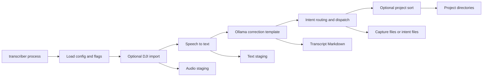

# Transcriber Codebase Quickstart

Transcriber is a local voice-capture pipeline: it turns DJI-style recordings into formatted, Obsidian-compatible Markdown and can extract voice-signalled todos, notes, article ideas, and blog posts. The installed `transcriber` command is intentionally thin; `Pipeline` coordinates filesystem stages while small modules own provider calls, formatting, routing, persistence, and classification.

Start with the task map below rather than making a change in `cli.py` merely because it is the entrypoint. For the complete ownership model, see [System Architecture and Ownership Boundaries](/openwiki/architecture/system-overview.md).

## Mental model

The workspace’s staged and output files carry progress between commands. The normal `process` command operates in a fixed order: load dictionaries, optionally import recordings, transcribe staged WAV files, format staged text through the LLM, route and dispatch current transcripts, then optionally move them into project directories.



This shows the normal CLI flow and the filesystem artifacts that serve as its state between stages.

The main entrypoint is the packaged console script `transcriber = "transcriber.cli:app"`. `process` loads TOML configuration, applies invocation-only flags, constructs `Pipeline`, and prints aggregate counters. The other commands are focused file operations: `classify`, `reprocess`, `reformat`, `config`, `templates`, `models`, and `models-create`.

## First developer run

The project requires Python 3.13 or later. Install the development extras, then use the command through `uv` while iterating:

```bash
uv pip install -e ".[dev]"
uv run transcriber --help
uv run transcriber config
uv run pytest
uv run mypy src/
uv run ruff check src/
```

A real `process` run additionally relies on the executables selected by configuration: the implemented defaults are `parakeet-mlx` for STT and `ollama` for LLM processing. The configuration schema also names `whisper` and `claude`, but the current factories do not implement them; choosing either raises `ValueError` rather than selecting a fallback. Consult [DJI, Speech-to-Text, and Ollama Integrations](/openwiki/integrations/external-tools-and-models.md) before changing a provider or model command.

For a controlled local invocation, use an explicit TOML file and inspect the selected values first:

```bash
uv run transcriber config --config ./transcriber.toml
uv run transcriber process --config ./transcriber.toml
```

Without `--config`, discovery prefers `./transcriber.toml`, then `~/.config/transcriber/config.toml`, then built-in defaults. `process --template`, `--dictionary`, `--sort`, and `--no-llm-fallback` mutate only the loaded in-memory configuration for that invocation; `--skip-import` skips only device import and still consumes audio already in staging.

## Choose the right change boundary

| If the task is about… | Start here | Then consult |
| --- | --- | --- |
| CLI syntax, flag wiring, exit behavior, console output, or a focused maintenance command | [`src/transcriber/cli.py`](repo://src/transcriber/cli.py) and [Transcript Maintenance Commands and Recovery](/openwiki/workflows/transcript-maintenance.md) | [System Architecture and Ownership Boundaries](/openwiki/architecture/system-overview.md) |
| Normal stage order, retry behavior, counters, or movement between stages | [End-to-End Recording Processing](/openwiki/workflows/process-recordings.md) | [Runtime Files, Metadata, and Mutation Boundaries](/openwiki/architecture/runtime-file-lifecycle.md) |
| Workspace location, TOML precedence, dictionaries, Jinja templates, tags, or Markdown/frontmatter shape | [Configuration, Dictionaries, Templates, and Markdown Output](/openwiki/concepts/configuration-and-output.md) | [Runtime Files, Metadata, and Mutation Boundaries](/openwiki/architecture/runtime-file-lifecycle.md) |
| New spoken trigger, `{person}` handling, fallback semantics, append versus individual-file output, or project rules | [Intent Extraction, Dispatch, and Project Classification](/openwiki/concepts/intent-routing-and-classification.md) | [End-to-End Recording Processing](/openwiki/workflows/process-recordings.md) |
| DJI discovery/renaming, Parakeet, Ollama invocation, output cleanup, timeouts, Modelfiles, or a new backend | [DJI, Speech-to-Text, and Ollama Integrations](/openwiki/integrations/external-tools-and-models.md) | [System Architecture and Ownership Boundaries](/openwiki/architecture/system-overview.md) |
| What to test, which dependencies are mocked, or how to validate a risky behavior change | [Testing and Safe Change Verification](/openwiki/testing/verification-strategy.md) | the affected workflow or concept page above |

### Ownership rule of thumb

- Put **orchestration and stage transitions** in `Pipeline`, not in a provider.
- Put a new STT or LLM backend behind its provider interface **and register it in its factory**; provider code reports success/failure, while the pipeline owns downstream file moves.
- Treat voice categories as an intent configuration plus routing/dispatch contract, not as CLI branches.
- Treat project taxonomy as classification rules and sorting behavior, not intent recognition.
- Treat templates, dictionary correction, and frontmatter as user-visible persistence contracts. Do not casually merge them into model prompting.

## Operational guardrails before changing behavior

- A normal run is a batch over directories. Successful STT moves its WAV out of audio staging; successful LLM processing moves its raw `.txt` out of text staging. Per-file failures remain staged for retry while the batch continues.
- An unavailable STT or LLM executable is reported as zero work for that stage, and the command continues to routing or sorting existing artifacts. Therefore a successful process exit is not proof that new audio was processed; read the counters and messages.
- Routing scans every direct `*.md` already in `transcripts/`, not only files just produced in this invocation. It prepends frontmatter and dispatches extracted intents. Append targets have no deduplication, so a rerun can add duplicate capture entries and additional frontmatter before sorting removes the transcript from that directory.
- `reprocess`, `reformat`, and standalone `classify` are mutation tools, not safe read-only views. In particular, `reprocess` relocates raw text and deletes an existing transcript before it checks whether the LLM is available; it recreates the formatted file but does not run normal routing or project sorting. Read the maintenance workflow before altering or invoking these commands on user data.

## Focused verification

Run the narrowest relevant group while developing, then the full suite and static checks before integrating a source change:

```bash
# CLI command shape and direct maintenance behavior
uv run pytest tests/test_cli.py

# Pipeline sequencing and mocked filesystem/tool integration
uv run pytest tests/test_pipeline.py tests/test_e2e.py

# Trigger, fallback, dispatch, and classification policy
uv run pytest tests/test_router.py tests/test_dispatch.py tests/test_classify.py

# Configuration and rendered Markdown contracts
uv run pytest tests/test_config.py tests/test_dictionary.py tests/test_templates.py tests/test_frontmatter.py

uv run mypy src/
uv run ruff check src/
uv run pytest
```

The end-to-end tests intentionally simulate `parakeet-mlx`, `ollama`, and the filesystem using temporary directories and mocks. They protect integration seams without requiring a connected DJI device, Apple Silicon, a running Ollama instance, or a downloaded model. A change to executable arguments, model behavior, or device layout still needs a controlled real-tool smoke test; [Testing and Safe Change Verification](/openwiki/testing/verification-strategy.md) identifies the combinations most likely to regress.

## Useful command families

```bash
# Process staged audio without accessing a DJI mount
transcriber process --skip-import

# Change run-scoped rendering and correction inputs
transcriber process --template blog.md --dictionary my-terms.yaml

# Inspect installed/packaged formatting and model choices
transcriber templates
transcriber models
transcriber models-create qwen3.5

# Targeted, state-mutating recovery commands
transcriber reprocess transcript-2026-04-18-09-22-49.md
transcriber reformat transcript.md --template summary.md
transcriber classify transcript.md --rules rules.yaml
```

Use `transcriber models` before `models-create`; the latter invokes `ollama create` against a packaged Modelfile. For command-level file preconditions and mutation order, use [Transcript Maintenance Commands and Recovery](/openwiki/workflows/transcript-maintenance.md), not this orientation page.
