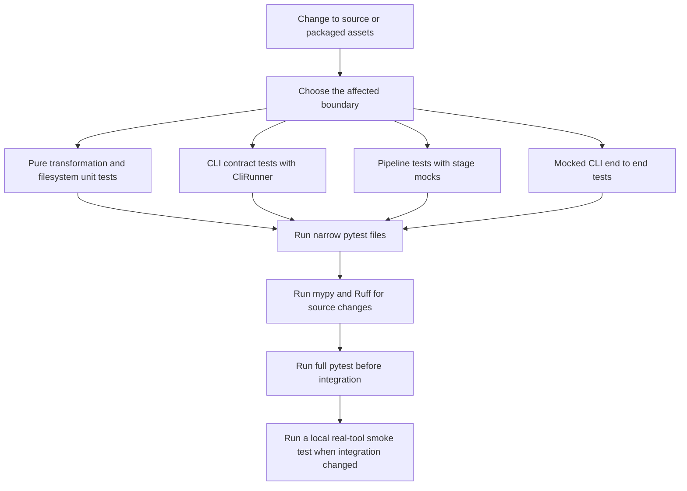

# Testing and Safe Change Verification

Transcriber is a batch-oriented filesystem pipeline with local command-line integrations. Its test strategy is therefore deliberately layered: fast unit tests protect deterministic transformations and output contracts, CLI tests protect Typer-facing behavior, orchestration tests isolate pipeline stage control flow, and mocked end-to-end tests cross the CLI, filesystem, and external-tool seams without requiring hardware, Apple Silicon, Parakeet MLX, Ollama, or a downloaded model.

The suite is a **safe-change signal**, not proof that a real recording can be transcribed or that a model produces good prose. In particular, provider availability and successful mocked subprocesses are not substitutes for a local operational smoke test after changing tool installation, models, or an external command contract. See [DJI, Speech-to-Text, and Ollama Integrations](/openwiki/integrations/external-tools-and-models.md) for those runtime contracts, [Intent Extraction, Dispatch, and Project Classification](/openwiki/concepts/intent-routing-and-classification.md) for routing semantics, and [Configuration, Dictionaries, Templates, and Markdown Output](/openwiki/concepts/configuration-and-output.md) for rendering and metadata ownership.

## Test topology

`pytest` discovers tests under `tests/` and the development extra installs `pytest`, `pytest-cov`, `mypy`, and `ruff`. The package exposes the Typer application as the `transcriber` console script; testing the app with Typer's `CliRunner` reaches command parsing without launching a subprocess or editing a user's real workspace. Type checking is configured in strict mode and Ruff checks error, undefined-name, import-order, and Python-upgrade rules.



This verification flow maps a change to the narrowest automated layer first, then expands to static checks, the full suite, and a real-tool smoke test only when an external integration changed.

### Boundary-to-test map

| Boundary / responsibility | Existing focused coverage | What the tests deliberately replace or avoid | Change risk that remains |
| --- | --- | --- | --- |
| DJI filename normalization and import staging | `tests/test_audio.py` uses `tmp_path` to test parsing, ISO names, destination creation, and an existing-destination skip. | No mounted DJI device or WAV decoding. | Test copy/move failures, invalid source layout, and collisions if changing import enumeration or rename rules. |
| STT provider selection and stage ownership | `tests/test_stt.py` checks the implemented factory, unknown-provider rejection, availability's Boolean surface, and result data shape. `tests/test_e2e.py` simulates `parakeet-mlx` creating the expected raw `.txt`. | The binary is not invoked; no audio is decoded. | A real tool's flags, output filename, nonzero exit, missing output, and platform prerequisites are largely untested directly. |
| Ollama formatting and fallback classification | `tests/test_llm.py` replaces `subprocess.run` and checks the command/input for classification plus ANSI and leading `Thinking...` cleanup for both calls. Router tests inject a mock provider for fallback decisions. | No Ollama daemon/model, inference, or response-quality assessment. | Formatting timeout/nonzero/missing-binary result handling and real model output should be exercised when provider code or model conventions change. |
| Regex routing and intent dispatch | `tests/test_router.py`, `tests/test_dispatch.py`, and `tests/test_intents.py` cover trigger extraction, fallback behavior, YAML loading, append output, and individual intent files. | LLM fallback responses are in-memory JSON; all output is temporary. | Repeated routing, target-path safety, and same-day file-slug collisions need explicit regression tests if altered. |
| Classification and final file relocation | `tests/test_classify.py` uses temporary files to protect ordered/case-insensitive matching, the `misc` fallback, generated tags, and move versus copy behavior. | No user rules file or production workspace. | Ordering is policy: changes to rule priority or substring semantics need representative rule fixtures. |
| Configuration, corrections, templates, and frontmatter | `tests/test_config.py`, `tests/test_dictionary.py`, `tests/test_templates.py`, and `tests/test_frontmatter.py` verify defaults/path derivation, correction and absent-file behavior, template lookup/render context, and metadata formatting/deduplication. | No user's home configuration or persistent workspace. | Add a pipeline-level fixture for custom TOML, template, dictionary, and routing metadata interactions when changing their ordering. |
| CLI surface and full pipeline | `tests/test_cli.py` invokes commands through `CliRunner`; `tests/test_pipeline.py` substitutes private stages; `tests/test_e2e.py` invokes `process` with a temporary TOML and mocked tools. | No installed console script, live model, or device. | Help and option assertions do not prove that every flag reaches its downstream stage; add behavior assertions with a temporary workspace when changing flag wiring. |

## The mocked end-to-end seam

The end-to-end tests are the highest-value automated integration layer because they drive `transcriber process --config <temporary TOML>` through configuration loading and the actual `Pipeline` stages. They create a synthetic `DJI_Audio_001/DJI_...WAV` input and temporary workspace. Their `shutil.which` double reports `parakeet-mlx` and `ollama` as present, while a `subprocess.run` side effect performs the observable external-tool behavior that the pipeline requires:

- for `parakeet-mlx`, it finds `--output-dir` in the requested command and writes `<audio stem>.txt` there;
- for `ollama`, it returns synthetic processed Markdown on stdout.

That distinction is important. The STT provider treats a zero exit without the expected text artifact as a failure, so the fake writes the artifact rather than merely returning `returncode=0`. The tests also cover `--skip-import`, a missing STT executable reported by the availability seam, and creation of the principal intermediate directories. They confirm that the CLI can complete the workflow under controlled provider behavior; they do **not** validate the tools' own processing or persisted output quality.

## Unit contracts worth preserving

### File transitions and output mutation

The pipeline loads corrections, optionally imports device audio, transcribes WAV files, formats raw text with the LLM and template, routes every direct transcript Markdown file, and optionally classifies/moves those transcripts. `PipelineResult.total_successful` intentionally equals only `processed`, not imports, transcriptions, routing writes, or classification moves. The orchestration unit tests patch these stage methods to verify that `run()` returns a result and that `skip_import=True` suppresses only import while later stages remain callable.

For a change near a stage boundary, retain both success and retry semantics:

- only a successful STT result moves a WAV from `audio-unprocessed` to `audio-processed`;
- only successful LLM processing followed by correction and template work moves raw text to `text-processed`;
- routing and dispatch happen after formatting, and classification happens after routing;
- an unavailable provider returns zero work for its batch stage rather than failing the whole `process` command.

The existing pipeline test has intentionally shallow stage coverage: it mocks the four private helpers and does not assert the ordering of successful filesystem mutations. The mocked end-to-end test supplies more integration confidence, but future changes to retries, moves, or partial failure recovery should add targeted temporary-directory tests at the public `Pipeline` boundary.

### Intent and classification policy

Routing tests protect the behavior most prone to accidental broadening: case-insensitive start triggers; punctuation and multi-word triggers; no match for ordinary prose; `{person}` extraction and person tags; sentence-bounded embedded captures; and a start intent plus later embedded intent. They also establish the fallback guardrail: regex extraction suppresses LLM fallback, while unavailable or timed-out fallback leaves an empty deterministic result instead of crashing.

Classification tests establish a different ordering invariant: rules are checked in YAML list order, then keywords in order, with case-insensitive substring matching. The first match wins; no match yields `misc`. The sorter normally moves the full file to `projects/<project>/`, whereas its `move=False` API preserves the original and uses `copy2`. Do not replace this group with only full-pipeline testing—small rule-order changes are faster and clearer to diagnose in isolation.

### Persisted Markdown contracts

Dispatch and frontmatter tests protect user-visible Markdown rather than only return values. Append dispatch must preserve existing content and emit a checkbox with source metadata; person items include `Assigned:` and embedded captures include an extracted-from reference. File dispatch writes generated frontmatter, the complete source text, and a date-prefixed Markdown name.

The correction/template/frontmatter groups similarly protect case-insensitive ordered replacement, template precedence/context, date tags, optional metadata fields, and tag deduplication. These are independent contracts: a visible transcript may contain template body tags before later routing prepends generated YAML frontmatter.

## High-risk combinations and missing regression coverage

A successful command exit is not an idempotency guarantee. Routing reads every direct `*.md` in `transcripts/`, prepends a newly generated frontmatter block to the text it read, and dispatches each extracted intent. Append dispatch always appends, while file dispatch uses a date-plus-content-slug path that can overwrite a same-day collision. A rerun before classification removes the transcript from that directory can therefore nest main-file frontmatter and duplicate capture entries. Neither the present unit suite nor mocked end-to-end suite asserts this repeated-run behavior.

Treat the following combinations as release-sensitive. Run the named narrow group first, then add a regression fixture when changing the behavior rather than relying on manual inspection alone.

| High-risk combination | Why it can fail silently or destructively | Minimum focused verification |
| --- | --- | --- |
| DJI rename change + import rerun | Normalized filename is the duplicate key; a collision must skip rather than overwrite, and normal pipeline import moves device input. | `uv run pytest tests/test_audio.py tests/test_e2e.py` |
| STT command/output change | A process exit is insufficient: the expected stem-matched `.txt` controls audio advancement. | `uv run pytest tests/test_stt.py tests/test_e2e.py`; then one controlled local WAV smoke test. |
| Ollama cleanup, timeout, or model change | Formatting and fallback share the executable but have 900-second and 60-second timeouts respectively; bad cleanup persists polluted Markdown or breaks JSON parsing. | `uv run pytest tests/test_llm.py tests/test_router.py tests/test_e2e.py`; then a real `ollama` smoke test. |
| Trigger pattern or intent YAML change | Person patterns take precedence, embedded matching is sentence-scoped, and any regex hit prevents fallback. | `uv run pytest tests/test_router.py tests/test_intents.py tests/test_dispatch.py` |
| Dispatch/frontmatter change + rerun behavior | Main files are overwritten with new metadata, append targets have no deduplication, and file names can collide. | `uv run pytest tests/test_dispatch.py tests/test_frontmatter.py tests/test_e2e.py`; add or run a two-pass temporary-workspace regression fixture. |
| Classification rules or sorter change | Substring matching and YAML order determine project selection; default sorting moves the source file. | `uv run pytest tests/test_classify.py` |
| Config/template/dictionary flag change | CLI overrides mutate in-memory configuration, dictionary rules are ordered, and templates overwrite output. | `uv run pytest tests/test_config.py tests/test_dictionary.py tests/test_templates.py tests/test_cli.py` |
| Pipeline stage/lifecycle change | Routing scans existing transcript files even if no new provider work occurred; optional classification runs after dispatch. | `uv run pytest tests/test_pipeline.py tests/test_e2e.py` |

## Narrow validation commands

Use `uv run` so the project interpreter and declared development dependencies are used. Start with the smallest group that proves the changed boundary:

```bash
# Routing, intent configuration, generated dispatch, and ordered classification
uv run pytest tests/test_router.py tests/test_dispatch.py tests/test_classify.py tests/test_intents.py

# External command boundary and its mocked process workflow
uv run pytest tests/test_audio.py tests/test_stt.py tests/test_llm.py tests/test_e2e.py

# Configuration-driven content rendering and command surface
uv run pytest tests/test_config.py tests/test_dictionary.py tests/test_templates.py tests/test_frontmatter.py tests/test_cli.py

# Pipeline coordination and temporary-workspace CLI flow
uv run pytest tests/test_pipeline.py tests/test_e2e.py
```

Before merging a source or packaged-asset change, run the full regression and static checks:

```bash
uv run pytest
uv run mypy src/
uv run ruff check src/
```

After changes to `audio.py`, `stt.py`, `llm.py`, a provider factory, model setup, or the external executable contract, run the focused mocked group **and** a local controlled smoke test. Check `transcriber config`, ensure the tools are visible to the same shell, use a disposable workspace/configuration, and inspect the generated text and file transitions. Do not use a real mounted device or valuable transcript collection as the first verification target: normal import moves successful source WAVs and formatting/routing overwrite or append files.

## How to extend coverage safely

1. **Keep external seams explicit.** Patch `shutil.which` and `subprocess.run` at the boundary, and make an STT fake create the exact output artifact expected by production. This exercises ownership logic without depending on local tools.
2. **Use `tmp_path` for every filesystem mutation.** Construct a minimal source layout and assert both the destination and whether the original remains, especially for move/copy behavior.
3. **Test observable Markdown and paths.** For routing changes, assert content, tags, frontmatter, append preservation, and the destination filename—not only an `ExtractedIntent` field.
4. **Add failure and rerun fixtures with every state-transition change.** Existing tests cover selected absence and fallback cases but not provider nonzero outcomes at every layer, partial post-processing failure, repeated routing, or slug collisions. These are the most valuable next tests when touching recovery behavior.
5. **Keep live validation out of ordinary CI tests.** A live Parakeet/Ollama test would make results depend on hardware, installed models, performance, and model nondeterminism. Reserve it for documented local smoke testing or a separately provisioned integration environment.

## Related pages

- [Configuration, Dictionaries, Templates, and Markdown Output](/openwiki/concepts/configuration-and-output.md)
- [Intent Extraction, Dispatch, and Project Classification](/openwiki/concepts/intent-routing-and-classification.md)
- [DJI, Speech-to-Text, and Ollama Integrations](/openwiki/integrations/external-tools-and-models.md)
