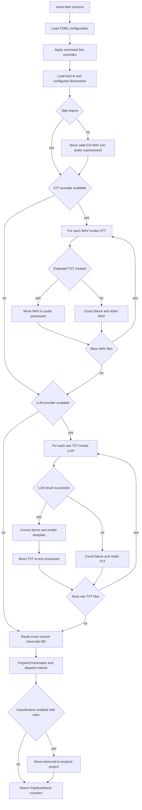

# End-to-End Recording Processing

`transcriber process` is a batch workflow over a local filesystem workspace. It is not a job queue and has no transaction or run manifest: the unprocessed and processed directories are the durable work state. The command loads a `TranscriberConfig`, applies invocation-only overrides, constructs `Pipeline`, and prints aggregate counters after `Pipeline.run()` returns. A successful command can still report zero work when a provider is unavailable, or report per-file STT/LLM failures.

This page is the operational trace of the normal command. For the complete file-state model and mutation cautions, see [Runtime Files, Metadata, and Mutation Boundaries](/openwiki/architecture/runtime-file-lifecycle.md). For the detailed routing rules and output contracts, see [Intent Extraction, Dispatch, and Project Classification](/openwiki/concepts/intent-routing-and-classification.md). Provider commands and model management are covered by [DJI, Speech-to-Text, and Ollama Integrations](/openwiki/integrations/external-tools-and-models.md).

## Control and data flow



This flow shows the normal stage order. Unavailable STT or LLM is a zero-work branch rather than a fatal pipeline result; a failed WAV or raw TXT remains staged while the batch continues with other files. Routing and sorting use the current `transcripts/` directory, so they can still act on older outputs after an upstream zero-work or failure branch.

## Invoke the workflow and establish configuration

The installed console script is `transcriber`. `process` accepts an optional TOML path and five controls:

| Command control | In-run effect |
| --- | --- |
| `--config`, `-c` | Selects an existing TOML file; without it, lookup is `./transcriber.toml`, then `~/.config/transcriber/config.toml`, then defaults. A nonexistent explicit path falls back to defaults. |
| `--skip-import` | Omits only the DJI import phase; already-staged `*.WAV` files can still be transcribed. |
| `--template`, `-t` | Replaces `output.template` in memory. |
| `--dictionary`, `-d` | Appends a YAML correction dictionary path in memory. |
| `--sort` | Sets `classify.enabled` in memory. It does not supply `classify.rules_file`. |
| `--no-llm-fallback` | Sets `router.llm_fallback` false for this run. It does **not** disable the LLM formatting phase. |

The workspace root defaults to `~/Resources/Transcripts`; derived locations beneath it are `.processing/audio-unprocessed`, `.processing/audio-processed`, `.processing/text-unprocessed`, `.processing/text-processed`, and `transcripts`. The default device source is `/Volumes/DJI_MIC2`, the implemented defaults are `parakeet` and `ollama`, and the LLM model default is `transcriber:latest`.

```bash
transcriber config
transcriber process --config ~/.config/transcriber/config.toml
```

Use `transcriber config` to inspect the selected root, providers, model, template, dictionary paths, and classification setting before moving device audio. The command prints source, output root, STT provider, LLM model, and template at startup; on completion it reports imported, transcribed, processed, optional classified/routed, and STT-plus-LLM failure counts. `PipelineResult.total_successful` means the number that completed the LLM/content stage (`processed`), not the number imported, routed, or project-sorted.

### Provider preflight is distinct from provider selection

`parakeet-mlx` and `ollama` must be resolvable on the invoking environment’s `PATH` for the built-in providers to be available. Availability failure is deliberately non-fatal: the corresponding stage reports a message and returns `(0, 0)`, then the workflow continues to later stages.

Do not confuse the configuration schema with the actual factory registry. The schema permits STT `whisper` and LLM `claude`, but `get_stt_provider()` presently registers only `parakeet` and `get_llm_provider()` only `ollama`. Selecting one of the declared-but-unregistered names raises `ValueError`; it is not treated as an unavailable provider. Adding a backend therefore requires both a provider implementation and factory registration, as well as updating configuration validation if needed.

## Stage 0: correction dictionary assembly

Before import, the pipeline always loads packaged dictionaries. It then loads each existing path in `dictionaries.paths` and concatenates those corrections after the built-ins; absent configured files are ignored. Each correction is applied later as a case-insensitive literal replacement. This assembly is outside the per-file LLM loop, so malformed/read failures that escape dictionary loading prevent the normal run from reaching import.

A configured or command-line `--dictionary` path is an extension point for domain vocabulary, but it does not replace the built-in corrections. Because application is sequential, later entries see the text produced by earlier entries.

## Stage 1: optional DJI import

Unless `--skip-import` is set, the pipeline calls `import_dji_audio(source, audio_unprocessed, move=True)`. The importer creates the destination directory before checking the source, scans immediate `DJI_Audio_*` directories in sorted order, and considers their immediate uppercase `*.WAV` files. It accepts only names matching `DJI_<number>_YYYYMMDD_HHMMSS.WAV` and normalizes them to `YYYY-MM-DD-HH-MM-SS.WAV`.

The normal workflow **moves**, rather than copies, a valid non-duplicate source WAV. A matching destination already present, or an invalid filename, increments the import skip count and leaves the source in place. A per-file `OSError` increments the import failure count and the importer continues. A missing mount/source is also non-fatal: the newly created staging directory and all-zero import counts are returned. The import library offers a `move=False` copy mode, but `process` does not expose it.

This phase produces the queue consumed by STT:

```text
<base>/.processing/audio-unprocessed/2025-07-02-17-54-46.WAV
```

`--skip-import` is suitable for manually staged files with any uppercase `.WAV` filename. It does not suppress STT, LLM processing, routing, or sorting.

## Stage 2: speech to text and the audio retry boundary

The pipeline creates `text-unprocessed` and `audio-processed`, obtains the configured STT provider, then enumerates direct `*.WAV` files in `audio-unprocessed`. There is no recursion and no ordering sort at this stage.

The built-in `ParakeetProvider` executes:

```text
parakeet-mlx <audio-file> --output-format txt --output-dir <output-dir>
```

The provider reports success only when `<audio stem>.txt` exists in the requested output directory after a successful subprocess call. A zero exit without that expected file is a failed transcription. A nonzero process exit or executable-not-found error also becomes a failed `TranscribeResult` with an error string.

For each successful result, **the pipeline**, not the provider, moves the WAV to `audio-processed`; the generated raw text remains in `text-unprocessed` for the next stage. A failed result increments `transcribe_failed` and leaves the WAV in `audio-unprocessed` for retry. The loop continues after a per-file failure. If no WAV files exist or the provider is unavailable, it returns zero successes and failures without aborting the pipeline.

There is no timeout on the built-in Parakeet subprocess call. Also, the STT factory accepts a `model` argument but the only registered provider is constructed without using it; do not expect `[stt].model` to affect current Parakeet invocation behavior.

## Stage 3: LLM cleanup, correction, templating, and the text retry boundary

The pipeline creates `text-processed` and `transcripts`, obtains the LLM provider, and enumerates direct `*.txt` files in `text-unprocessed`. For each raw text filename `<stem>.txt`, the intended output is:

```text
<base>/transcripts/transcript-<stem>.md
```

### Built-in Ollama behavior

`OllamaProvider` reads the raw text and runs the configured model as:

```text
ollama run <configured-model>
```

The text is passed on standard input. The provider uses a 900-second timeout, removes ANSI terminal escape sequences and one recognized leading `Thinking...` through `...done thinking.` trace from stdout, writes the cleaned output to the requested Markdown path, and returns a successful `ProcessResult`. A timeout, nonzero command exit, or missing executable is translated into an unsuccessful result.

On provider success, the pipeline performs the remaining content work on the same Markdown file:

1. Apply the merged correction dictionary when it has corrections.
2. Render `output.template` through Jinja2 with `content`, `metadata.source_file`, and date-derived `metadata.tags` such as `#transcript #2025 #2025-07`.
3. Overwrite the Markdown with the rendered result.
4. Move the raw TXT to `text-processed` and increment `processed`.

Template lookup is ordered: caller-supplied extra directories, `~/.config/transcriber/templates/`, then packaged templates. The normal pipeline supplies no extra directories, so a same-named user template shadows a packaged template. The template produces presentation content; it is not the final routing metadata contract.

A failed provider result increments `process_failed` and leaves raw text in `text-unprocessed`, allowing a future run to retry it. If the LLM provider is unavailable or no raw files exist, this stage returns zero work and routing still follows. The provider catches expected subprocess failures, but the pipeline does not roll back a successfully written output if a later dictionary operation, template rendering, or raw-text move fails: those are separate filesystem operations and an uncaught error ends the run.

## Stage 4: route existing transcripts, enrich metadata, and dispatch

Routing is a post-formatting sweep, not a list of just-produced outputs. `_route_and_dispatch()` reads every direct `*.md` currently in `transcripts/`, including outputs from prior runs. It loads a configured intents file only when its expanded path exists; otherwise it uses packaged intents. When fallback is enabled, it supplies the configured LLM provider only if that provider reports available.

For each transcript, deterministic regex routing runs first. It supports start-of-text and sentence-level embedded triggers, with `{person}` trigger variants taking precedence over simple triggers. Any regex extraction prevents the LLM fallback call. Only with no regex result can the fallback ask the provider for JSON-shaped intents and suggested tags; malformed JSON, missing data, unavailable fallback, subprocess failure, and timeout fail open to the existing routing result. This fallback has a 60-second Ollama timeout, separate from 15-minute content formatting.

If classification is enabled and a rules file exists, routing additionally classifies the text before metadata generation. It adds the returned project and classification tags, then appends intent-local tags and deduplicates all main-transcript tags in first-seen order. This is metadata enrichment only; the final project relocation is a later phase.

### Main transcript mutation

The router derives `source` from the transcript filename by removing `transcript-` and appending `.WAV`, and uses `datetime.now()` at routing time. It generates YAML frontmatter containing date, source, tags, and—when set—primary intent and project, then overwrites the main file with that block followed by the entire text it just read.

This operation does not parse or replace an existing frontmatter block. Re-routing an unsorted transcript nests another generated header and can dispatch its intents again. The timestamp is routing time rather than a parsed recording timestamp. Treat `transcripts/` as mutable staging, not an idempotent published-output directory.

### Intent target writes

Each extracted intent is matched to the first configured intent definition with the same `type`; definitions determine `append` or `file` output and a path relative to `paths.base`.

| Output mode | Effect |
| --- | --- |
| `append` | Creates parent directories and appends a checkbox plus timestamp, source, and tags to the target. Person captures add an assignee; embedded captures include the main transcript reference. Existing content is retained. |
| `file` | Creates the target directory and writes `<YYYY-MM-DD>-<slug>.md`, with intent frontmatter and the complete pre-routing transcript text as the body. The same-day slug path can be overwritten. |

Neither dispatch mode deduplicates reruns. An LLM fallback can create an unconfigured type; its type tag remains eligible for main metadata, but no target write occurs because no matching intent definition is found. Filesystem errors while reading/writing transcripts or dispatching are not converted into per-file routing counts and can abort the workflow.

## Stage 5: optional project classification and final location

The final classification phase runs only when `classify.enabled` is true, either from TOML or `--sort`. It still requires an existing `classify.rules_file`; no configured or missing file reports a message and leaves flat transcripts in `transcripts/`.

Rules are ordered YAML project entries. `classify_text()` uses case-insensitive substring matching and chooses the first project rule with any matching keyword; no match maps to `misc`. The earlier routing enrichment and this phase use the same rules but have different outcomes:

- Routing assigns the project and tags into main-transcript frontmatter before dispatch.
- The final phase calls `sort_transcript()` for every Markdown file still in `transcripts/`, creates `projects/<project>/`, and moves the full transcript there.

The normal pipeline always uses move mode. Once moved, a transcript is absent from the flat directory on later normal runs, whereas intent captures stay in their configured base-relative targets. Classification and sorting are not protected by a per-file exception handler or destination-conflict policy; choose rule order and avoid duplicate final filenames deliberately.

## Continuation, failure, and rerun semantics

| Situation | Immediate outcome | Later-stage behavior and recovery state |
| --- | --- | --- |
| DJI source absent | Destination directory exists; import counts are zero. | STT and all later stages still run against existing workspace files. |
| Invalid DJI name or normalized destination already exists | Import counts it as skipped. | Source stays put; no overwrite occurs. |
| Import move/copy raises `OSError` | Counts one failed import and continues scanning. | That source file is not staged by that attempt. |
| STT provider unavailable | Prints a message and reports zero STT work. | Audio remains in `audio-unprocessed`; existing TXT and MD can still progress. |
| One STT result fails | Counts failure and retains that WAV. | Other WAVs continue; retry by fixing the issue and running again. |
| LLM provider unavailable | Prints a message and reports zero LLM work. | Raw TXT remains retryable; routing may still process older Markdown. |
| One LLM result fails | Counts failure and retains that TXT. | Other raw texts continue; rerun retries the retained input. |
| Formatting-after-LLM, routing I/O, dispatch, or sorting raises an uncaught filesystem/content error | The current run can terminate. | Earlier moves/writes are not rolled back; inspect intermediate files before rerunning. |
| Regex fallback cannot provide usable JSON | Routing retains its regex result and does not fail the batch for that condition. | A no-regex transcript can receive metadata with no dispatched intent. |

The counters are therefore useful operational telemetry, but are not a transaction result. `processed` is only incremented after LLM success, corrections, template rendering, and the raw-text move. Conversely, `routed` counts extracted intents dispatched, not the number of transcript files swept, and `classified` counts transcripts passed through final sorting.

## Safe operation and focused verification

1. Confirm the mounted DJI source, workspace root, installed tools, and desired model with `transcriber config` and, for Ollama assets, `transcriber models`.
2. Use `--skip-import` only when intended WAV files have already been placed in `audio-unprocessed`; it deliberately does not isolate the run from pending raw texts or transcripts.
3. Configure a rules file before using `--sort`. Rule ordering is priority because the first matching project wins.
4. Inspect and preserve outputs before rerunning an unsorted batch: routing and append dispatch are not idempotent, and file-mode intent names can collide.
5. If retaining original device audio is required, do not rely on normal `process` import: it moves valid recordings. Use the import API in copy mode or stage copies separately.

The focused tests reflect these boundaries. `tests/test_e2e.py` composes mocked Parakeet and Ollama through the CLI for normal import, `--skip-import`, unavailable STT, and directory creation. `tests/test_pipeline.py` pins stage delegation, skip-import behavior, and result-counter semantics. The provider, audio, router, dispatch, and classification tests cover the expected output artifact, fallback behavior, intent target mutation, first-match classification, and move/copy sorting contracts.

```bash
uv run pytest tests/test_audio.py tests/test_stt.py tests/test_llm.py tests/test_pipeline.py tests/test_e2e.py tests/test_router.py tests/test_dispatch.py tests/test_classify.py
```

## Related pages

- [System Architecture and Ownership Boundaries](/openwiki/architecture/system-overview.md)
- [Runtime Files, Metadata, and Mutation Boundaries](/openwiki/architecture/runtime-file-lifecycle.md)
- [Intent Extraction, Dispatch, and Project Classification](/openwiki/concepts/intent-routing-and-classification.md)
- [DJI, Speech-to-Text, and Ollama Integrations](/openwiki/integrations/external-tools-and-models.md)
- [Transcript maintenance workflow](/openwiki/workflows/transcript-maintenance.md)
