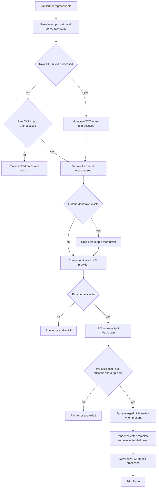

# Transcript Maintenance Commands and Recovery

The normal `transcriber process` run owns the full audio-to-transcript lifecycle. The commands on this page are narrower, operator-invoked maintenance tools. They can overwrite, delete, or move user files and do not provide confirmation, backups, transactions, routing, or project-sorting rollback. Use a disposable workspace or make a copy before applying them to valuable material.

The durable recovery input for an already completed transcript is its raw `.txt` file in `.processing/text-processed/`; the corresponding Markdown in `transcripts/` is a replaceable presentation artifact. See [Runtime Files, Metadata, and Mutation Boundaries](/openwiki/architecture/runtime-file-lifecycle.md) for the broader workspace model, [Configuration, Dictionaries, Templates, and Markdown Output](/openwiki/concepts/configuration-and-output.md) for rendering semantics, and [End-to-End Recording Processing](/openwiki/workflows/process-recordings.md) for the normal pipeline.

## Choose the appropriate command

| Goal | Command | What it acts on | Principal mutation |
| --- | --- | --- | --- |
| Regenerate a transcript from retained raw text with another LLM model, dictionary, or template | `transcriber reprocess <file>` | A derived raw-text name and an output Markdown path | May move raw text back to the retry queue, deletes the old output, rewrites output, then moves raw text to processed storage on success. |
| Apply another visual/body template to current Markdown only | `transcriber reformat <file> --template <name>` | Exactly the path supplied | Overwrites that file with template output whose `content` is the entire prior file. |
| Put one existing transcript into its classified project directory | `transcriber classify <file> [--rules <path>]` | Exactly the path supplied | Moves the file to `<base>/projects/<project>/<original-name>`. |
| Inspect packaged Ollama model recipes or create one | `transcriber models` / `transcriber models-create <name>` | Packaged `*.Modelfile` assets and the local Ollama CLI | The listing is read-only; creation delegates image creation to `ollama create`. |

`reprocess` and standalone `classify` load TOML configuration, so their `--config` path follows the usual configuration behavior: a supplied existing file is loaded, while a missing supplied file falls back to defaults. `reprocess --template` replaces the in-memory template for that invocation and `--dictionary` appends one dictionary path; neither persists a configuration change. `reformat` has no `--config` option and defaults to `default.md`.

## Reprocess: restore raw text, replace Markdown, and run the content phase

### Input resolution and preconditions

Invoke `reprocess` using the usual normal-output filename, for example:

```bash
transcriber reprocess transcript-2026-04-18-09-22-49.md --template summary.md
```

A relative `<file>` is resolved under `<base>/transcripts/`; an absolute path is used as given. The command derives its raw input mechanically: it takes the output path stem, removes one leading `transcript-` if present, and appends `.txt`. The example therefore maps to `.processing/text-processed/2026-04-18-09-22-49.txt` (or the same name in `text-unprocessed`). It does not require that the requested Markdown currently exists, and it does not validate that the supplied filename has the normal extension or prefix. Confirm the derived pairing yourself when passing an unusual path.

The raw text is the mandatory precondition. The command searches `text-processed` first, then `text-unprocessed`; when neither contains the derived name, it prints both searched directories and exits with status 1. This missing-raw branch occurs before any output deletion, so the existing Markdown is preserved.

The raw file is accepted from `text-unprocessed` to support retrying an incomplete prior attempt. When it is found in `text-processed`, the command immediately moves it to `text-unprocessed`. That move happens before the LLM availability check, so an unavailable provider leaves the raw file in the unprocessed retry state rather than returning it automatically to processed storage.

### Mutation and failure flow



This flow shows the source-defined `reprocess` precondition checks and mutations. In particular, output deletion precedes provider availability and raw text advances back to `text-processed` only after LLM processing, correction, and rendering complete.

After raw-text selection, `reprocess` unlinks the requested Markdown if it exists **before** it checks `provider.is_available()`. It then calls the configured LLM provider with raw text as input and the requested Markdown path as output. With the implemented `ollama` provider, `ollama run <model>` receives the raw text on standard input, has a 900-second timeout, strips ANSI escape sequences and one recognized leading thinking trace, and writes cleaned standard output to the output path.

A false availability check or an unsuccessful `ProcessResult` prints an error and exits 1. At that point the old Markdown is already gone if it existed, and raw text remains in `text-unprocessed`; this is the recovery state for a later rerun. There is no compensating restore of the old output or move back to `text-processed`. Likewise, later dictionary, template, read/write, or final move failures are not wrapped in this command's `typer.Exit` handling, so they can leave an output artifact and raw text in the unprocessed directory.

On successful provider processing, the command reproduces the normal content-processing order:

1. Load packaged dictionaries, then append corrections from existing user-configured and `--dictionary` paths.
2. Apply the sequential, case-insensitive corrections to the provider-written Markdown and overwrite that same output file.
3. Render the configured template with `metadata.source_file` set to the derived raw name and date tags derived from the output stem; overwrite the output again.
4. Move the raw `.txt` from `text-unprocessed` to `text-processed` and report success.

This command deliberately stops there. It does **not** invoke routing, frontmatter generation, intent dispatch, or optional project sorting. Consequently, its replacement contains the chosen template body and date tags but does not acquire newly generated routing frontmatter unless a later normal pipeline run routes it. Do not use `reprocess` as a way to update a transcript that was moved into `projects/` without first considering where the replacement output should go: an absolute file path can delete that file but the command does not move it back to its project directory.

### Safe recovery procedure

1. Inspect the effective workspace and model: `transcriber config`, then `transcriber models` if using Ollama recipes.
2. Copy the existing Markdown to a backup location. This is essential because the command may delete it even when the LLM is unavailable or fails.
3. Verify the derived `.txt` is present in either raw-text directory. If it is absent, recover it from a backup; `reprocess` cannot reconstruct raw text from Markdown.
4. Confirm `ollama` is on `PATH`, the configured provider is implemented, and the selected model is installed.
5. Run `reprocess`, inspect the result in `transcripts/` or the supplied absolute output path, and move or route it intentionally if your workflow needs those later phases.

## Reformat: destructive template application without raw-text recovery

`reformat` is intentionally simpler than `reprocess`:

```bash
transcriber reformat /path/to/transcript.md --template summary.md
```

It first verifies the exact supplied path exists. A missing file produces a message and exit status 1. For an existing file, it reads the whole file as a string, calls `render_transcript(content, template_name=template)`, writes the rendered result back to the same path, and prints the selected template name.

There is no raw-text lookup, LLM invocation, dictionary pass, metadata argument, configuration load, routing, or classification. The template renderer searches the user template directory before packaged templates, so a user template with the same filename can change the result. Template lookup or rendering errors are not translated into a friendly command-specific exit path.

> **Frontmatter warning:** `reformat` does not parse, preserve, or merge existing frontmatter. Old YAML or other headings are passed to the template as `content`; a subsequent reformat applies a template around the already rendered document. Copy the input first and regard repeated reformatting as non-idempotent unless the particular template was designed for it.

Use `reformat` only where rewrapping current Markdown is desired. Use `reprocess` when the raw `.txt`, LLM transformation, correction dictionary, and filename-derived template metadata must be reapplied.

## Standalone classify: immediate file relocation

`classify` is a one-file form of project sorting, not a metadata enrichment operation:

```bash
transcriber classify /path/to/transcript.md --rules /path/to/projects.yaml
```

It loads configuration, then chooses the rules path in this order: `--rules` when supplied, otherwise `classify.rules_file` from configuration. It rejects a missing or nonexistent rules file with an error and exit status 1, then separately rejects a nonexistent transcript path with status 1. Only after both checks does it calculate `<base>/projects` and call `sort_transcript()`.

Rule loading expects YAML `projects` entries with a `name` and optional `keywords`. Classification lowercases the file's complete text and performs case-insensitive substring matching in YAML rule order and keyword order. The first matching project wins; no match uses `misc`. While `classify_text()` can produce normalized tags, standalone classification does not write those tags or otherwise alter file content.

The sorter creates `<base>/projects/<project>/` and uses its default `move=True`, so the source file is removed and reappears as `<base>/projects/<project>/<original-filename>`. There is no `--copy`, dry-run, confirmation, destination-conflict guard, or command-local recovery handling. A collision or filesystem failure is therefore outside the explicit validation branches; ensure the target name is safe and copy the source yourself if it must remain in its original location. In contrast, the underlying `sort_transcript(..., move=False)` library API uses `copy2`, but neither this command nor the normal pipeline selects that mode.

## Local Ollama model management

The package ships `gemma4`, `llama3.3`, `muse`, and `qwen3.5` Modelfile recipes under `src/transcriber/builtin_modelfiles/`. They define a base image and formatter instructions but do not create an Ollama model merely by being installed.

### Inspect recipes and local status

```bash
transcriber models
```

`models` fails with status 1 only if the packaged Modelfile directory is absent or contains no `*.Modelfile`. Otherwise it lists the recipes. If `ollama` is discoverable, it runs `ollama list`, takes the first whitespace-delimited item from each nonempty output line, and labels a recipe `created` only when it finds `transcriber-<name>:latest`. A nonzero `ollama list` is ignored for this status check; the command still prints the recipes as `not created`. Thus a successful `models` exit reports packaged assets, not a healthy Ollama installation or a usable model.

### Create and select a recipe-derived model

```bash
transcriber models-create qwen3.5
```

`models-create` requires both `ollama` on `PATH` and an exact packaged file named `qwen3.5-transcriber.Modelfile`. Missing either condition prints an error and exits 1; an unknown name also prints the available logical names. For a valid name it runs:

```text
ollama create transcriber-qwen3.5 -f <modelfile>
```

A nonzero `ollama create` result is reported and exits 1. On success, the command recommends configuring `model = "transcriber-qwen3.5:latest"`. It does not independently validate or download the `FROM` base model named in the recipe; Ollama owns that requirement and the create operation's outcome.

Set the resulting model in configuration before `process` or `reprocess`:

```toml
[llm]
provider = "ollama"
model = "transcriber-qwen3.5:latest"
```

The current LLM factory implements `ollama` only. Although the configuration type also permits `claude`, selecting it reaches an unknown-provider error rather than an unavailable-provider result. The same distinction applies to any future provider change: a configuration value, provider factory registration, executable/API availability check, and model/runtime setup must all agree.

## Exit behavior and verification focus

The maintenance commands use `typer.Exit(1)` for their explicit validation failures: missing raw text or unavailable/failed LLM work in `reprocess`; missing input in `reformat`; missing rules or input in `classify`; and missing assets, executable, recipe, or failed creation in model commands. By contrast, the normal `process` command prints aggregate stage failures but does not raise based on `PipelineResult`, so per-file processing failures and unavailable batch providers can still result in a zero CLI exit.

Not every operational failure is converted to `typer.Exit(1)`: YAML parsing, template errors, filesystem moves/unlinks/writes, unknown provider selection, and other uncaught exceptions propagate through the CLI framework. Treat any nonzero exit as a need to inspect both the console message and workspace state, rather than assuming the old output is intact.

Focused automated coverage currently verifies that CLI help exposes `classify`, `reformat`, `reprocess`, `models`, and `models-create`; that reformatting applies a template in place; that missing raw text is rejected; that recipe names are listed even when Ollama is unavailable; and that an invalid model name is rejected. File-level classification tests separately pin first-match policy, `misc`, and move versus copy behavior. The suite does not exercise a successful `reprocess` round trip or rollback behavior, so changes to its mutation order should add temporary-directory tests for provider-unavailable, provider-failure, and post-render-failure states.

```bash
uv run pytest tests/test_cli.py tests/test_classify.py tests/test_llm.py tests/test_templates.py tests/test_dictionary.py
```

## Related pages

- [Runtime Files, Metadata, and Mutation Boundaries](/openwiki/architecture/runtime-file-lifecycle.md)
- [Configuration, Dictionaries, Templates, and Markdown Output](/openwiki/concepts/configuration-and-output.md)
- [DJI, Speech-to-Text, and Ollama Integrations](/openwiki/integrations/external-tools-and-models.md)
- [Testing and Safe Change Verification](/openwiki/testing/verification-strategy.md)
- [End-to-End Recording Processing](/openwiki/workflows/process-recordings.md)
